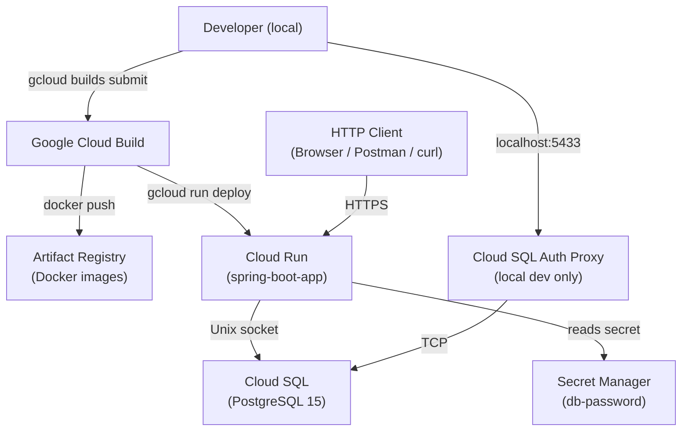
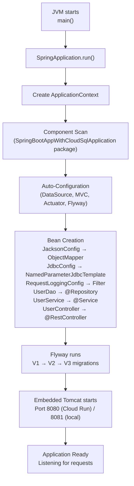
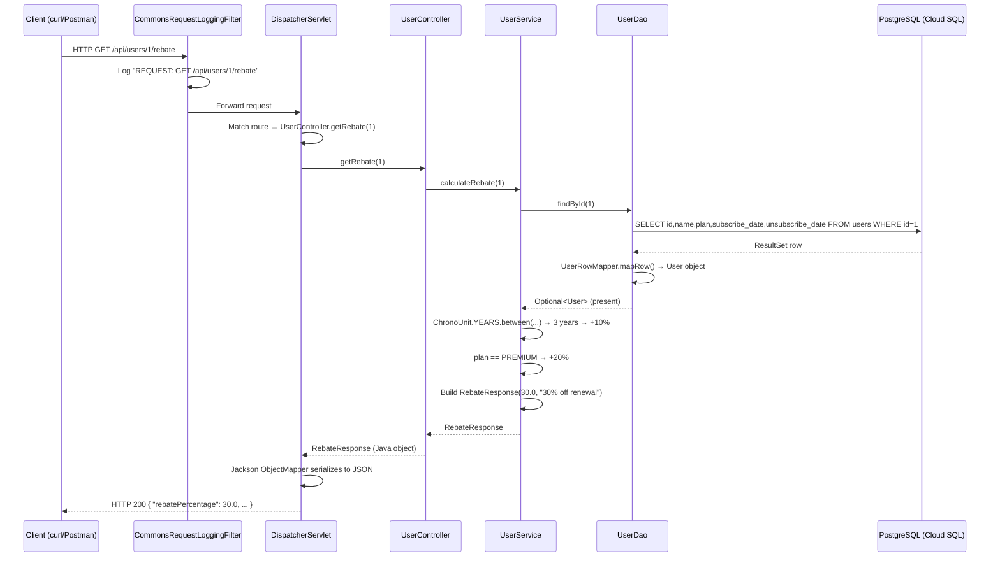
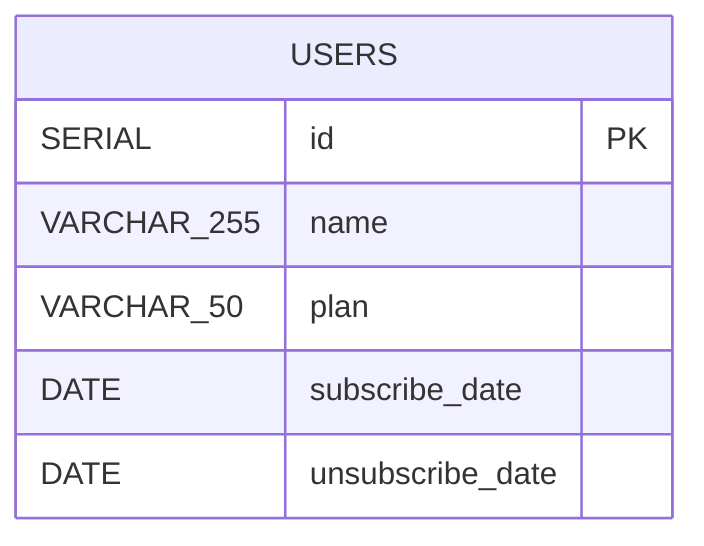
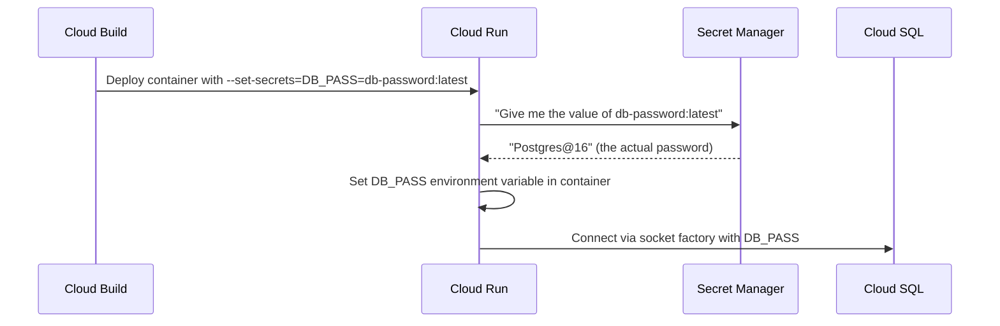
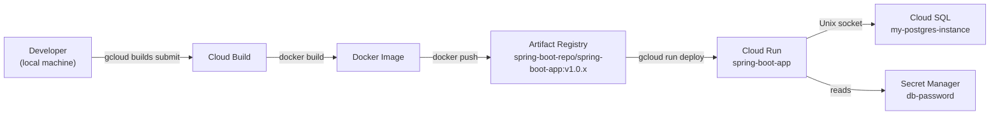

# Code Walkthrough — Spring Boot REST API with Cloud SQL & Cloud Run

> **Document type:** Developer Onboarding · Knowledge Transfer · Architecture · Deployment · Troubleshooting
>
> **Project:** `spring-boot-app-with-cloud-sql`
> **Branch:** `feature/cloud-run`
> **Live URL:** `https://spring-boot-app-rire725v4q-uc.a.run.app`

---

## Table of Contents

1. [Project Overview](#1-project-overview)
2. [Business Use Case](#2-business-use-case)
3. [Functional Requirements](#3-functional-requirements)
4. [Non-Functional Requirements](#4-non-functional-requirements)
5. [High-Level Architecture](#5-high-level-architecture)
6. [Folder Structure Walkthrough](#6-folder-structure-walkthrough)
7. [Technology Stack](#7-technology-stack)
8. [Dependency Analysis](#8-dependency-analysis)
9. [Build Configuration Analysis](#9-build-configuration-analysis)
10. [Configuration Files Analysis](#10-configuration-files-analysis)
11. [Java Source Code Walkthrough](#11-java-source-code-walkthrough)
12. [Spring Boot Startup Lifecycle](#12-spring-boot-startup-lifecycle)
13. [Request Processing Lifecycle](#13-request-processing-lifecycle)
14. [Database Design](#14-database-design)
15. [Flyway Migration Analysis](#15-flyway-migration-analysis)
16. [Docker Analysis](#16-docker-analysis)
17. [Local Development Setup Guide](#17-local-development-setup-guide)
18. [Local Testing Guide](#18-local-testing-guide)
19. [API Documentation](#19-api-documentation)
20. [Cloud SQL Integration Guide](#20-cloud-sql-integration-guide)
21. [Cloud Build Guide](#21-cloud-build-guide)
22. [Cloud Run Deployment Guide](#22-cloud-run-deployment-guide)
23. [CI/CD Pipeline Explanation](#23-cicd-pipeline-explanation)
24. [Security Considerations](#24-security-considerations)
25. [Performance Considerations](#25-performance-considerations)
26. [Logging and Monitoring](#26-logging-and-monitoring)
27. [Troubleshooting Guide](#27-troubleshooting-guide)
28. [Production Support Guide](#28-production-support-guide)
29. [Interview Questions and Answers](#29-interview-questions-and-answers)
30. [Glossary](#30-glossary)

---

## 1. Project Overview

### ELI10 (Explain Like I'm 10)

Imagine a shop that keeps a list of members. Each member pays either a basic fee or a premium fee. If they have been a member for more than one year, they get a discount on their next bill — we call that a **rebate**. This app is like the shop's computer system. You can add members, look them up, change their details, remove them, and ask "how much discount does this member get?" All the member information is saved in a proper database so nothing is lost when the computer turns off.

### Professional Explanation

This is a **RESTful web service** built with Spring Boot 4.1.0 that manages user subscription data and computes dynamic rebate percentages. It uses:

- **Spring JDBC** (`NamedParameterJdbcTemplate`) for database access — deliberately avoiding JPA/Hibernate to keep SQL explicit and readable.
- **Flyway** for versioned, repeatable database migrations applied automatically on startup.
- **Google Cloud SQL (PostgreSQL 15)** as the managed relational database.
- **Google Cloud Run** as the serverless container runtime.
- **Google Cloud Build** for CI/CD — building a Docker image, pushing to Artifact Registry, and deploying to Cloud Run.
- **Springdoc OpenAPI** to generate live Swagger UI documentation.
- **JaCoCo + SonarCloud** for code coverage and static analysis.

### Key Features

| Feature | Description |
|---------|-------------|
| CRUD for Users | Create, read, update, delete user records |
| Rebate Calculation | Business logic: loyalty + plan tier stacked up to 30% |
| Flyway Migrations | Automatic schema versioning; seed data in V3 |
| Cloud Run Deployment | Containerised, scales to zero, pays per request |
| Cloud SQL Integration | Managed PostgreSQL via Unix socket (no open TCP port) |
| Swagger UI | Live interactive API explorer |
| Request Logging | Every HTTP request body logged via Servlet filter |
| SonarCloud | Automated quality gate on every build |

---

## 2. Business Use Case

A subscription-based business needs to:

1. Store member records (name, plan tier, subscription start/end dates).
2. Calculate renewal discounts (rebates) based on how long a member has been subscribed and which plan they hold.
3. Expose these capabilities through a clean HTTP API consumed by front-end applications, mobile apps, or other back-end services.

### Rebate Rules (Business Logic)

| Condition | Rebate Added |
|-----------|-------------|
| Subscribed for more than 1 year | +10% loyalty |
| On PREMIUM plan | +20% plan bonus |
| Both above | 30% total (10 + 20, stackable) |
| BASIC plan, less than 1 year | 0% |
| No subscription date recorded | 0% |
| Unsubscribed (`unsubscribe_date` is set) | 0% |

---

## 3. Functional Requirements

| ID | Requirement |
|----|------------|
| FR-01 | Create a new user with name, plan, subscribe date |
| FR-02 | Retrieve a single user by ID |
| FR-03 | Retrieve all users |
| FR-04 | Update any user field |
| FR-05 | Delete a user by ID |
| FR-06 | Calculate and return rebate percentage with human-readable message |
| FR-07 | Return 404-style error when user not found |
| FR-08 | Dates must serialize as ISO-8601 strings (e.g. `2022-03-15`) |

---

## 4. Non-Functional Requirements

| ID | Requirement |
|----|------------|
| NFR-01 | No plain-text credentials in source code or git history |
| NFR-02 | Zero-downtime deployments via Cloud Run revisions |
| NFR-03 | All HTTP requests logged (URL, body, query string) |
| NFR-04 | Test coverage enforced via JaCoCo + SonarCloud |
| NFR-05 | Code formatting enforced via Spotless (Google Java Format) |
| NFR-06 | Containerised — identical image runs locally and in production |
| NFR-07 | Database schema changes tracked and versioned (Flyway) |
| NFR-08 | API self-documented via Swagger UI |

---

## 5. High-Level Architecture



### Component Interactions

| Component | Role |
|-----------|------|
| Cloud Build | Builds Docker image, pushes to Artifact Registry, deploys to Cloud Run |
| Artifact Registry | Stores versioned Docker images (`spring-boot-repo/spring-boot-app:v1.0.x`) |
| Cloud Run | Runs the containerised Spring Boot app; scales to zero when idle |
| Cloud SQL | Managed PostgreSQL; connected via Unix socket on Cloud Run, TCP proxy locally |
| Secret Manager | Holds `db-password`; injected as `DB_PASS` env var into the container |
| Cloud SQL Auth Proxy | Local dev tool that tunnels TCP connections to Cloud SQL |

---

## 6. Folder Structure Walkthrough

```
spring-boot-app-with-cloud-sql/
├── src/
│   ├── main/
│   │   ├── java/com/cloud/sql/spring_boot_app_with_cloud_sql/
│   │   │   ├── SpringBootAppWithCloudSqlApplication.java   ← Entry point
│   │   │   ├── config/
│   │   │   │   ├── JacksonConfig.java                      ← JSON serialization
│   │   │   │   ├── JdbcConfig.java                         ← JDBC template bean
│   │   │   │   └── RequestLoggingConfig.java               ← HTTP request logger
│   │   │   ├── controller/
│   │   │   │   └── UserController.java                     ← REST endpoints
│   │   │   ├── dto/
│   │   │   │   └── RebateResponse.java                     ← API response shape
│   │   │   ├── entity/
│   │   │   │   ├── User.java                               ← Domain model
│   │   │   │   └── SubscriptionType.java                   ← Enum: BASIC / PREMIUM
│   │   │   ├── repo/
│   │   │   │   ├── UserDao.java                            ← SQL data access
│   │   │   │   └── UserRowMapper.java                      ← ResultSet → User
│   │   │   └── service/
│   │   │       └── UserService.java                        ← Business logic
│   │   └── resources/
│   │       ├── application.properties                      ← Local profile (gitignored)
│   │       ├── application.properties.template             ← Safe committed template
│   │       ├── application-cloudrun.properties             ← Cloud Run profile
│   │       └── db/migration/
│   │           ├── V1__create_users_table.sql
│   │           ├── V2__add_subscription_fields_to_users.sql
│   │           └── V3__seed_users.sql
│   └── test/
│       └── java/com/cloud/sql/spring_boot_app_with_cloud_sql/
│           ├── controller/
│           │   └── UserControllerTest.java                 ← 6 tests (@WebMvcTest)
│           ├── repo/
│           │   └── UserRowMapperTest.java                  ← 2 tests (mocked ResultSet)
│           └── service/
│               └── UserServiceTest.java                    ← 11 tests (Mockito)
├── gradle.lockfile                                         ← Dependency lock file (reproducible builds)
├── build.gradle                                            ← Gradle build script (Groovy DSL)
├── settings.gradle                                         ← Project name (Groovy DSL)
├── Dockerfile                                              ← Multi-stage Docker build
├── cloudbuild.yaml                                         ← GCP CI/CD pipeline
├── gradlew / gradlew.bat                                   ← Gradle wrapper scripts
├── gradle/wrapper/gradle-wrapper.properties               ← Gradle version pin
├── README.md                                               ← Quickstart guide
└── code-walkthrough.md                                     ← This document
```

### Package Convention Explained

The base package is `com.cloud.sql.spring_boot_app_with_cloud_sql`. This follows the reverse-domain naming convention:

| Segment | Meaning |
|---------|---------|
| `com` | Commercial top-level domain |
| `cloud.sql` | Simulated company/department name |
| `spring_boot_app_with_cloud_sql` | Application name (matches artifact ID) |

Sub-packages mirror the **layered architecture**:

| Package | Layer | Responsibility |
|---------|-------|---------------|
| `controller` | Presentation | Receive HTTP requests, return HTTP responses |
| `service` | Business | Apply business rules, orchestrate operations |
| `repo` | Data Access | Execute SQL, map results to Java objects |
| `entity` | Domain Model | Pure data classes representing database rows |
| `dto` | Data Transfer | Shapes specific to API responses (not DB rows) |
| `config` | Infrastructure | Spring bean definitions, framework configuration |

---

## 7. Technology Stack

| Category | Technology | Version | Why Chosen |
|----------|------------|---------|-----------|
| Language | Java | 21 | LTS release; virtual threads, records, sealed classes |
| Framework | Spring Boot | 4.1.0 | Convention-over-configuration; embedded server; auto-config |
| Web Layer | Spring MVC | 7.0.8 | Servlet-based REST; mature and well-tested |
| Data Access | Spring JDBC | 7.0.8 | Explicit SQL; no ORM magic; full control |
| Migrations | Flyway | (managed by Spring Boot BOM) | Versioned, idempotent SQL migrations |
| Database | PostgreSQL | 15 | Managed Cloud SQL; ACID; rich data types |
| API Docs | SpringDoc OpenAPI | 2.8.9 | Zero-config Swagger UI from annotations |
| Build | Gradle (Groovy DSL) | 9.5.1 | Expressive build scripts; incremental builds; dependency locking |
| Container | Docker | multi-stage | Reproducible builds; slim runtime image |
| CI/CD | Google Cloud Build | managed | Native GCP integration; no server to manage |
| Runtime | Google Cloud Run | managed | Serverless; scales to zero; pay per request |
| Image Store | Artifact Registry | managed | Secure Docker registry in GCP |
| Secret Store | Secret Manager | managed | Credentials never in env vars or code |
| Coverage | JaCoCo | managed by plugin | XML report consumed by SonarCloud |
| Analysis | SonarCloud | SaaS | Quality gates, duplication, vulnerability scanning |
| Formatting | Spotless + Google Java Format | 7.0.4 | Enforced consistent style; CI-safe |

---

## 8. Dependency Analysis

Each dependency in `build.gradle` is explained below.

### Runtime / Compile Dependencies

#### `spring-boot-starter-webmvc`

```
implementation("org.springframework.boot:spring-boot-starter-webmvc")
```

- **What it is:** Pulls in Spring MVC, an embedded Tomcat server, Jackson for JSON, and all web-layer auto-configuration.
- **Why needed:** Without this there is no HTTP server — the app cannot accept requests.
- **If removed:** Application starts but cannot serve any HTTP traffic. `@RestController` beans will not bind to any port.

#### `spring-boot-starter-jdbc`

```
implementation("org.springframework.boot:spring-boot-starter-jdbc")
```

- **What it is:** Includes `JdbcTemplate`, `NamedParameterJdbcTemplate`, `DataSource` auto-configuration, and connection pool (HikariCP by default).
- **Why needed:** All database access goes through `NamedParameterJdbcTemplate` declared in `JdbcConfig`.
- **If removed:** `DataSource` bean will not be created; `UserDao` will fail to initialise; app will not start.

#### `spring-boot-starter-flyway` + `flyway-core` + `flyway-database-postgresql`

```
implementation("org.springframework.boot:spring-boot-starter-flyway")
implementation("org.flywaydb:flyway-core")
implementation("org.flywaydb:flyway-database-postgresql")
```

- **What it is:** Flyway database migration engine; the PostgreSQL-specific dialect module.
- **Why three entries?** `starter-flyway` provides Spring Boot auto-config; `flyway-core` is the engine; `flyway-database-postgresql` provides PostgreSQL-specific SQL parsing (required since Flyway 10 split dialects into separate jars).
- **If removed:** Migrations (V1, V2, V3) will not run. Database schema will be missing; app will fail on first SQL call.

#### `spring-boot-starter-actuator`

```
implementation("org.springframework.boot:spring-boot-starter-actuator")
```

- **What it is:** Exposes management endpoints like `/actuator/health` and `/actuator/info`.
- **Why needed:** Health check used by Cloud Run to determine if the container is ready to receive traffic.
- **If removed:** Cloud Run has no health endpoint to probe; it may mark the revision as failed.

#### `springdoc-openapi-starter-webmvc-ui`

```
implementation("org.springdoc:springdoc-openapi-starter-webmvc-ui:2.8.9")
```

- **What it is:** Scans Spring MVC controllers at startup and generates an OpenAPI 3.0 spec, then serves Swagger UI at `/swagger-ui/index.html`.
- **Why needed:** Interactive API documentation with zero manual effort.
- **If removed:** No Swagger UI; no OpenAPI spec endpoint. Developers must rely on README for API details.

#### `postgresql`

```
runtimeOnly("org.postgresql:postgresql")
```

- **What it is:** JDBC driver for PostgreSQL. `runtimeOnly` means it is not needed at compile time — just at runtime when actual DB connections are made.
- **Why needed:** Without this, the JDBC layer cannot speak the PostgreSQL wire protocol.
- **If removed:** `DataSource` creation fails at startup with `No suitable driver found`.

#### `postgres-socket-factory`

```
implementation("com.google.cloud.sql:postgres-socket-factory:1.21.0")
```

- **What it is:** Google's JDBC socket factory that replaces TCP with a Unix domain socket when running on Cloud Run. Handles IAM authentication to Cloud SQL automatically.
- **Why needed:** Cloud Run connects to Cloud SQL via a Unix socket sidecar — no public IP, no firewall rules, no VPN.
- **If removed:** The `application-cloudrun.properties` JDBC URL (`socketFactory=...`) will throw `ClassNotFoundException`; Cloud Run will fail to connect to the database.

### Test Dependencies

#### `spring-boot-starter-test`

```
testImplementation("org.springframework.boot:spring-boot-starter-test")
```

- **What it is:** Bundles JUnit 5, Mockito, AssertJ, MockMvc, and Spring Test together.
- **Why needed:** All test infrastructure comes from this single starter.

#### `spring-boot-starter-webmvc-test`

```
testImplementation("org.springframework.boot:spring-boot-starter-webmvc-test")
```

- **What it is:** In Spring Boot 4, `@WebMvcTest` moved to a separate starter. Provides `MockMvc` auto-configuration for slice tests.
- **Why needed:** `UserControllerTest` uses `@WebMvcTest` — without this starter it cannot find the annotation.

#### `junit-platform-launcher`

```
testRuntimeOnly("org.junit.platform:junit-platform-launcher")
```

- **What it is:** Required by Gradle to discover and execute JUnit 5 tests.
- **Why needed:** Without it, `./gradlew test` finds no tests.

---

## 9. Build Configuration Analysis

### `settings.gradle`

```groovy
rootProject.name = 'spring-boot-app-with-cloud-sql'
```

**Line by line:**

| Line | Explanation |
|------|------------|
| `rootProject.name = 'spring-boot-app-with-cloud-sql'` | Sets the Gradle project name. This becomes the artifact name (the JAR file is named `spring-boot-app-with-cloud-sql-0.0.1-SNAPSHOT.jar`). Must match across `build.gradle` and deployment configs. |

---

### `build.gradle`

```groovy
plugins {
    id 'java'
    id 'org.springframework.boot' version '4.1.0'
    id 'io.spring.dependency-management' version '1.1.7'
    id 'com.diffplug.spotless' version '7.0.4'
    id 'org.sonarqube' version '6.2.0.5505'
    id 'jacoco'
}
```

#### Plugin Breakdown

| Plugin | Purpose | If Removed |
|--------|---------|-----------|
| `java` | Adds `compileJava`, `test`, `jar` tasks | Cannot compile Java at all |
| `org.springframework.boot` | Adds `bootJar` task; configures Spring Boot auto-repackaging | `./gradlew bootJar` fails; cannot produce executable fat JAR |
| `io.spring.dependency-management` | Imports Spring BOM — all Spring dependency versions are managed centrally | Must specify every Spring dependency version manually |
| `com.diffplug.spotless` | Enforces Google Java Format; `spotlessCheck` / `spotlessApply` tasks | No formatting enforcement; code style diverges over time |
| `org.sonarqube` | Adds `sonar` task to push results to SonarCloud; version `6.2.0.5505` required for Gradle 9 compatibility (earlier versions used the removed `Convention` API) | No static analysis integration |
| `jacoco` | Built-in Gradle plugin; produces coverage XML/HTML report | No coverage data; SonarCloud cannot show coverage |

```groovy
group = 'com.cloud.sql'
version = '0.0.1-SNAPSHOT'
```

- `group`: Maven group ID. Part of artifact coordinates `com.cloud.sql:spring-boot-app-with-cloud-sql:0.0.1-SNAPSHOT`.
- `version`: `SNAPSHOT` suffix signals this is a development build, not a release.

```groovy
java {
    toolchain {
        languageVersion = JavaLanguageVersion.of(21)
    }
}
```

**Toolchain:** Tells Gradle to use Java 21 specifically. If the machine has multiple JDKs installed, Gradle will pick the correct one (or auto-provision it). This ensures consistent builds across developer machines and CI.

```groovy
spotless {
    java {
        googleJavaFormat()
        removeUnusedImports()
        trimTrailingWhitespace()
        endWithNewline()
    }
}
```

**Spotless rules:**
- `googleJavaFormat()` — reformats all Java files to Google's style (2-space indents, specific brace placement).
- `removeUnusedImports()` — removes `import` statements that are not referenced.
- `trimTrailingWhitespace()` — removes spaces at end of lines.
- `endWithNewline()` — ensures every file ends with a newline (Unix convention).

```groovy
def springdocVersion = '2.8.9'
def cloudSqlSocketFactoryVersion = '1.21.0'
```

Extracting hardcoded versions into variables prevents drift — changing a library version is a one-line edit at the top of the file, and the string appears only once. SonarCloud also flags inline version literals as a maintainability smell.

```groovy
dependencyLocking {
    lockAllConfigurations()
}
```

Enables Gradle dependency locking. Once enabled, run `./gradlew dependencies --write-locks` to generate `gradle.lockfile`, which pins every transitive dependency to its exact resolved version. Without this file, a new transitive dependency version could silently appear in a build. SonarCloud flags the absence of a lockfile as a **Security** issue (unpredictable dependency versions).

```groovy
sonar {
    properties {
        property 'sonar.projectKey', 'spring-boot-app-with-cloud-sql'
        property 'sonar.organization', 'spring-boot-app-with-cloud-sq'
        property 'sonar.host.url', 'https://sonarcloud.io'
        property 'sonar.coverage.jacoco.xmlReportPaths', "${layout.buildDirectory.get()}/reports/jacoco/test/jacocoTestReport.xml"
        property 'sonar.exclusions', '**/config/**,**/dto/**,**/entity/**'
    }
}
```

| Property | Value | Meaning |
|----------|-------|---------|
| `sonar.projectKey` | `spring-boot-app-with-cloud-sql` | Unique identifier on SonarCloud dashboard |
| `sonar.organization` | `spring-boot-app-with-cloud-sq` | SonarCloud organisation slug (created during SonarCloud signup) |
| `sonar.host.url` | `https://sonarcloud.io` | SonarCloud SaaS endpoint (not self-hosted SonarQube) |
| `sonar.coverage.jacoco.xmlReportPaths` | `build/reports/jacoco/.../jacocoTestReport.xml` | Path to the JaCoCo XML report Sonar reads for coverage % |
| `sonar.exclusions` | `**/config/**,**/dto/**,**/entity/**` | Packages excluded from analysis — config beans, DTOs, and entities are structural boilerplate with little logic to analyse |

**Authentication:** The SonarCloud token is never in code. It is set as an environment variable in the terminal before running:

```powershell
$env:SONAR_TOKEN = "your_token_here"
./gradlew clean test jacocoTestReport sonar
```

SonarCloud reads `SONAR_TOKEN` automatically from the environment. Storing it in `build.gradle` or any committed file is a critical security violation.

**SonarCloud quality results (achieved):**

| Category | Rating | Issues |
|----------|--------|--------|
| Security | A | 0 |
| Reliability | A | 0 |
| Maintainability | A | 0 |
| Coverage (overall) | — | ~60% |
| Duplications | — | 0.0% |

**Issues fixed to reach 0:**

| # | Issue | Fix Applied |
|---|-------|------------|
| 1 | Missing dependency lockfile | Enabled `dependencyLocking`; generated `gradle.lockfile` |
| 2 | `rs.getDate()` deprecated | Replaced with `rs.getObject(..., LocalDate.class)` in `UserRowMapper` |
| 3 | `LocalDate.now()` without timezone | Changed to `LocalDate.now(Clock.systemUTC())` in `UserService` |
| 4 | Magic int `1` for month | Changed to `Month.JANUARY` enum in `UserControllerTest` |
| 5–7 | Hardcoded version strings | Extracted to `def springdocVersion` and `def cloudSqlSocketFactoryVersion` |

```groovy
tasks.withType(Test) {
    useJUnitPlatform()
    finalizedBy jacocoTestReport
}

jacocoTestReport {
    dependsOn test
    reports {
        xml.required = true
        html.required = true
    }
}
```

- `useJUnitPlatform()` — tells Gradle to use JUnit 5 engine to run tests.
- `finalizedBy jacocoTestReport` — always generate the coverage report after tests, even if tests fail.
- `xml.required = true` — SonarCloud reads the XML format; HTML is for humans browsing locally.

---

## 10. Configuration Files Analysis

### `application.properties` (local dev — gitignored)

```properties
spring.application.name=spring-boot-app-with-cloud-sql
server.forward-headers-strategy=framework
server.port=8081
spring.datasource.url=jdbc:postgresql://127.0.0.1:5433/appdb
spring.datasource.username=postgres
spring.datasource.password=Postgres@16
spring.flyway.enabled=true
spring.flyway.locations=classpath:db/migration
logging.level.org.springframework.web=DEBUG
logging.level.org.springframework.jdbc.core=DEBUG
logging.level.org.springframework.jdbc.core.StatementCreatorUtils=TRACE
logging.level.org.springframework.web.filter.CommonsRequestLoggingFilter=DEBUG
```

| Property | Purpose |
|----------|---------|
| `spring.application.name` | Application identifier; appears in logs and actuator info |
| `server.forward-headers-strategy=framework` | Trusts `X-Forwarded-*` headers from reverse proxies (Cloud Run sits behind GCP's load balancer) |
| `server.port=8081` | Local dev uses 8081 to avoid conflicts with other services on 8080 |
| `spring.datasource.url` | JDBC URL pointing to Cloud SQL Auth Proxy on `127.0.0.1:5433` |
| `spring.datasource.username` | PostgreSQL username |
| `spring.datasource.password` | PostgreSQL password — **must never be committed to git** |
| `spring.flyway.enabled=true` | Enables automatic migration on startup |
| `spring.flyway.locations` | Directory containing migration SQL files |
| `logging.level.org.springframework.web=DEBUG` | Logs every Spring MVC request routing decision |
| `logging.level.org.springframework.jdbc.core=DEBUG` | Logs every SQL statement executed |
| `logging.level...StatementCreatorUtils=TRACE` | Logs actual parameter values bound to SQL |
| `logging.level...CommonsRequestLoggingFilter=DEBUG` | Activates request body logging from `RequestLoggingConfig` |

> **Security note:** This file contains the real database password. It is in `.gitignore`. Use `application.properties.template` as the committed reference.

---

### `application.properties.template` (committed — safe)

Identical structure to `application.properties` but with `YOUR_CLOUD_SQL_PASSWORD` as placeholder. This is the file new developers copy when setting up locally:

```bash
cp src/main/resources/application.properties.template \
   src/main/resources/application.properties
```

Then they fill in their own credentials. Spring Boot ignores `.template` files — only `application.properties` is auto-loaded.

---

### `application-cloudrun.properties` (Cloud Run profile)

```properties
spring.datasource.url=jdbc:postgresql:///${DB_NAME}?cloudSqlInstance=${INSTANCE_CONNECTION_NAME}&socketFactory=com.google.cloud.sql.postgres.SocketFactory
spring.datasource.username=${DB_USER}
spring.datasource.password=${DB_PASS}
spring.flyway.enabled=true
spring.flyway.locations=classpath:db/migration
server.port=${PORT:8080}
server.forward-headers-strategy=framework
logging.level.root=INFO
logging.level.com.cloud.sql=INFO
```

**How it is activated:** `cloudbuild.yaml` passes `--set-env-vars=SPRING_PROFILES_ACTIVE=cloudrun` to Cloud Run. Spring Boot's profile mechanism then loads `application-cloudrun.properties` on top of (and overriding) the base `application.properties`.

| Property | Cloud Run Value | Explanation |
|----------|----------------|-------------|
| `spring.datasource.url` | Socket Factory JDBC URL | Uses Unix socket instead of TCP; no open port needed |
| `${DB_NAME}` | `appdb` | Injected by Cloud Run via `--set-env-vars=DB_NAME=appdb` |
| `${INSTANCE_CONNECTION_NAME}` | `spring-boot-app-with-cloud-sql:us-central1:my-postgres-instance` | Identifies the Cloud SQL instance |
| `socketFactory=com.google.cloud.sql.postgres.SocketFactory` | Google's socket factory class | Replaces TCP with a managed Unix socket connection |
| `${DB_PASS}` | From Secret Manager | Injected via `--set-secrets=DB_PASS=db-password:latest` |
| `server.port=${PORT:8080}` | Cloud Run sets `PORT` env var | Default 8080 if not set |
| `logging.level.root=INFO` | Less verbose logging | Reduces cost in Cloud Logging |

---

## 11. Java Source Code Walkthrough

### File: `SpringBootAppWithCloudSqlApplication.java`

```java
package com.cloud.sql.spring_boot_app_with_cloud_sql;

import org.springframework.boot.SpringApplication;
import org.springframework.boot.autoconfigure.SpringBootApplication;

@SpringBootApplication
public class SpringBootAppWithCloudSqlApplication {

  public static void main(String[] args) {
    SpringApplication.run(SpringBootAppWithCloudSqlApplication.class, args);
  }
}
```

#### Line-by-Line

| Line | Explanation |
|------|------------|
| `package ...` | Declares namespace — must match directory structure |
| `import SpringApplication` | The class that bootstraps Spring Boot — creates `ApplicationContext`, starts embedded server |
| `import SpringBootApplication` | Meta-annotation (see below) |
| `@SpringBootApplication` | Combines three annotations: `@SpringBootConfiguration` (marks as config source), `@EnableAutoConfiguration` (triggers auto-config), `@ComponentScan` (scans this package and all sub-packages for `@Component`, `@Service`, `@Repository`, `@Controller`) |
| `public static void main(String[] args)` | Standard Java entry point — JVM starts here |
| `SpringApplication.run(...)` | Creates the Spring container, runs all startup phases, starts Tomcat, runs Flyway |

#### What Happens If Removed?

Without this class there is no entry point. The JAR cannot start. Every other class is unreachable.

---

### File: `config/JacksonConfig.java`

```java
@Configuration
public class JacksonConfig {

  @Bean
  public ObjectMapper objectMapper() {
    return new ObjectMapper()
        .registerModule(new JavaTimeModule())
        .disable(SerializationFeature.WRITE_DATES_AS_TIMESTAMPS);
  }
}
```

#### Imports Explained

| Import | Purpose |
|--------|---------|
| `ObjectMapper` | Jackson's central class for serializing Java → JSON and deserializing JSON → Java |
| `SerializationFeature` | Enum of on/off switches for Jackson serialization behaviour |
| `JavaTimeModule` | Jackson module that adds support for `java.time.*` types (LocalDate, LocalDateTime, etc.) |
| `@Bean` | Marks method as a factory for a Spring-managed bean |
| `@Configuration` | Marks class as a source of `@Bean` definitions |

#### Why This File Exists

Spring Boot 4 uses Jackson 3, which moved its enum types to the `tools.jackson` package. The property `spring.jackson.serialization.write-dates-as-timestamps=false` cannot be bound via `.properties` files in this version. Without this manual `@Bean`, `LocalDate` fields serialize as `[2022, 3, 15]` (array) instead of `"2022-03-15"` (string).

#### Execution Flow

1. Spring starts up and scans `config` package.
2. Finds `@Configuration` on `JacksonConfig`.
3. Calls `objectMapper()` method and registers the returned `ObjectMapper` as a bean.
4. Spring MVC's message converters use this `ObjectMapper` for every JSON serialization/deserialization.

#### What Happens If Removed?

All `LocalDate` fields in API responses will appear as JSON arrays like `[2022,3,15]` instead of `"2022-03-15"`. Tests that check date format will fail.

---

### File: `config/JdbcConfig.java`

```java
@Configuration
public class JdbcConfig {

  @Bean
  public NamedParameterJdbcTemplate namedParameterJdbcTemplate(DataSource dataSource) {
    return new NamedParameterJdbcTemplate(dataSource);
  }
}
```

#### Imports Explained

| Import | Purpose |
|--------|---------|
| `javax.sql.DataSource` | Standard Java interface representing a database connection source (provided by HikariCP) |
| `NamedParameterJdbcTemplate` | Spring JDBC wrapper — executes SQL with named parameters (`:name`, `:id`) instead of positional `?` |

#### Why Named Parameters?

```java
// Positional (JdbcTemplate) — fragile
jdbcTemplate.update("INSERT INTO users VALUES (?, ?)", name, plan);

// Named (NamedParameterJdbcTemplate) — readable and safe
jdbcTemplate.update("INSERT INTO users (name, plan) VALUES (:name, :plan)", params);
```

Named parameters eliminate bugs where parameter order is wrong, and make SQL much more readable.

#### Execution Flow

Spring Boot auto-creates a `DataSource` (HikariCP connection pool) from the JDBC URL in `application.properties`. `JdbcConfig` takes that `DataSource` and wraps it in a `NamedParameterJdbcTemplate` which is injected into `UserDao`.

#### What Happens If Removed?

`UserDao` cannot be instantiated because no `NamedParameterJdbcTemplate` bean exists. App fails at startup with `NoSuchBeanDefinitionException`.

---

### File: `config/RequestLoggingConfig.java`

```java
@Configuration
public class RequestLoggingConfig {

  @Bean
  public CommonsRequestLoggingFilter requestLoggingFilter() {
    CommonsRequestLoggingFilter filter = new CommonsRequestLoggingFilter();
    filter.setIncludeQueryString(true);
    filter.setIncludePayload(true);
    filter.setMaxPayloadLength(1000);
    filter.setIncludeHeaders(false);
    filter.setAfterMessagePrefix("REQUEST: ");
    return filter;
  }
}
```

#### Imports Explained

| Import | Purpose |
|--------|---------|
| `CommonsRequestLoggingFilter` | Built-in Spring Servlet filter — logs HTTP request details before and after processing |

#### Configuration Options

| Setting | Value | Effect |
|---------|-------|--------|
| `setIncludeQueryString(true)` | true | Appends `?param=value` to the log line |
| `setIncludePayload(true)` | true | Logs the request body (POST/PUT content) |
| `setMaxPayloadLength(1000)` | 1000 chars | Truncates body at 1000 characters to avoid flooding logs |
| `setIncludeHeaders(false)` | false | Skips logging headers (would expose auth tokens) |
| `setAfterMessagePrefix("REQUEST: ")` | prefix | Log line starts with `REQUEST: ` making it searchable in Cloud Logging |

#### Activation

This filter only produces output when its logger is at `DEBUG` level:

```properties
logging.level.org.springframework.web.filter.CommonsRequestLoggingFilter=DEBUG
```

This is set in `application.properties` (local) but deliberately omitted from `application-cloudrun.properties` (Cloud Run uses `INFO` level to reduce logging cost).

#### What Happens If Removed?

No HTTP request body logging. All other functionality continues normally.

---

### File: `controller/UserController.java`

```java
@RestController
@RequestMapping("/api/users")
public class UserController {

  private final UserService service;

  public UserController(UserService service) {
    this.service = service;
  }
  ...
}
```

#### Annotations Explained

| Annotation | Purpose |
|-----------|---------|
| `@RestController` | Combines `@Controller` (marks as Spring MVC controller) + `@ResponseBody` (all return values serialized to JSON automatically) |
| `@RequestMapping("/api/users")` | All methods in this class handle URLs starting with `/api/users` |
| `@PostMapping` | Maps HTTP `POST /api/users` to `create()` |
| `@GetMapping` | Maps HTTP `GET /api/users` to `findAll()` |
| `@GetMapping("/{id}")` | Maps HTTP `GET /api/users/1` to `findById()` |
| `@PutMapping("/{id}")` | Maps HTTP `PUT /api/users/1` to `update()` |
| `@DeleteMapping("/{id}")` | Maps HTTP `DELETE /api/users/1` to `delete()` |
| `@GetMapping("/{id}/rebate")` | Maps HTTP `GET /api/users/1/rebate` to `getRebate()` |
| `@ResponseStatus(HttpStatus.CREATED)` | Sets HTTP 201 response code for `create()` (instead of default 200) |
| `@PathVariable Integer id` | Extracts `1` from `/api/users/1` into the `id` parameter |
| `@RequestBody User user` | Deserializes the JSON request body into a `User` object |

#### Constructor Injection

```java
public UserController(UserService service) {
    this.service = service;
}
```

Spring sees a single constructor and automatically injects the `UserService` bean. No `@Autowired` needed. Constructor injection is preferred over field injection because:
- Dependencies are explicit
- `UserController` cannot be constructed without `UserService` (null-safe)
- Easier to unit test — just `new UserController(mockService)`

#### Method Summary

| Method | HTTP | Path | Returns | Status |
|--------|------|------|---------|--------|
| `create` | POST | `/api/users` | Created `User` with generated ID | 201 |
| `findAll` | GET | `/api/users` | List of all users | 200 |
| `findById` | GET | `/api/users/{id}` | Single `User` | 200 |
| `update` | PUT | `/api/users/{id}` | Updated `User` | 200 |
| `delete` | DELETE | `/api/users/{id}` | `"User deleted successfully"` | 200 |
| `getRebate` | GET | `/api/users/{id}/rebate` | `RebateResponse` with % and message | 200 |

---

### File: `entity/User.java`

```java
public class User {
  private Integer id;
  private String name;
  private String plan;
  private LocalDate subscribeDate;
  private LocalDate unsubscribeDate;
  ...
}
```

#### ELI10

Think of `User` as a form with blank fields. When someone fills in the form with a name, plan, and dates — that's one User object. The app passes these forms around between layers.

#### Professional Explanation

`User` is the **domain model** — a plain Java class (POJO) with no framework annotations. It represents one row in the `users` database table. Keeping it annotation-free means it has zero coupling to Spring, Jackson, or any persistence framework.

#### Field Mapping

| Java Field | DB Column | Java Type | Notes |
|-----------|-----------|-----------|-------|
| `id` | `id` | `Integer` | Auto-generated by PostgreSQL SERIAL; null on insert |
| `name` | `name` | `String` | Required — NOT NULL in DB |
| `plan` | `plan` | `String` | Values: `"BASIC"` or `"PREMIUM"` |
| `subscribeDate` | `subscribe_date` | `LocalDate` | ISO-8601 date; nullable |
| `unsubscribeDate` | `unsubscribe_date` | `LocalDate` | Set when member cancels; nullable |

#### Why `String plan` Instead of `SubscriptionType plan`?

Storing `plan` as a `String` in the entity keeps DB storage simple (a plain `VARCHAR`). The business rule comparison (`SubscriptionType.PREMIUM.name().equals(user.getPlan())`) happens in the service layer, not the entity — clean separation of concerns.

#### Three Constructors

| Constructor | Purpose |
|------------|---------|
| `User()` | No-arg — required for Jackson deserialization (reads JSON body) |
| `User(id, name)` | Convenience — used in tests to create simple users quickly |
| `User(id, name, plan, subscribeDate, unsubscribeDate)` | Full constructor — used by `UserRowMapper` when reading from DB |

---

### File: `entity/SubscriptionType.java`

```java
public enum SubscriptionType {
  BASIC,
  PREMIUM
}
```

#### What Is an Enum?

An `enum` is a type with a fixed set of named constants. Instead of writing magic strings like `"PREMIUM"` everywhere and risking typos, you use `SubscriptionType.PREMIUM` which the compiler checks.

#### Usage in the Project

Used **only in `UserService.calculateRebate()`**:

```java
if (SubscriptionType.PREMIUM.name().equals(user.getPlan())) {
    rebate += 20.0;
}
```

`SubscriptionType.PREMIUM.name()` returns the string `"PREMIUM"` — compared against the `plan` field which is stored as a `VARCHAR` in the database.

---

### File: `dto/RebateResponse.java`

```java
public class RebateResponse {
  private final Integer userId;
  private final String name;
  private final String plan;
  private final LocalDate subscribeDate;
  private final double rebatePercentage;
  private final String message;
  ...
}
```

#### What Is a DTO?

**DTO = Data Transfer Object.** It is a container shaped specifically for the API response. It is *not* the same as `User` because:
- It adds computed fields (`rebatePercentage`, `message`) that don't exist in the database.
- It is immutable (`final` fields, no setters) — once created it cannot be changed.
- It signals to the caller exactly what the rebate endpoint returns.

#### Why Immutable?

Since `RebateResponse` is created once in `UserService.calculateRebate()` and never modified, making all fields `final` prevents accidental mutation. It is thread-safe by design.

#### Fields

| Field | Type | Description |
|-------|------|-------------|
| `userId` | `Integer` | Echoes back the user ID |
| `name` | `String` | User's name |
| `plan` | `String` | `"BASIC"` or `"PREMIUM"` |
| `subscribeDate` | `LocalDate` | When they subscribed |
| `rebatePercentage` | `double` | 0.0 / 10.0 / 20.0 / 30.0 |
| `message` | `String` | Human-readable explanation of the rebate |

#### Sample JSON Response

```json
{
  "userId": 1,
  "name": "Alice Johnson",
  "plan": "PREMIUM",
  "subscribeDate": "2022-03-15",
  "rebatePercentage": 30.0,
  "message": "10% loyalty rebate (subscribed for over 1 year) + 20% Premium plan rebate. Total: 30% off renewal."
}
```

---

### File: `repo/UserRowMapper.java`

```java
@Component
public class UserRowMapper implements RowMapper<User> {

  @Override
  public User mapRow(ResultSet rs, int rowNum) throws SQLException {
    return new User(
        rs.getInt("id"),
        rs.getString("name"),
        rs.getString("plan"),
        rs.getObject("subscribe_date", LocalDate.class),
        rs.getObject("unsubscribe_date", LocalDate.class));
  }
}
```

#### ELI10

When the database sends back a row of data, it's like a spreadsheet row. `UserRowMapper` reads each cell and puts the value into the right field of a `User` object.

#### Annotations

| Annotation | Purpose |
|-----------|---------|
| `@Component` | Registers this class as a Spring bean so it can be injected into `UserDao` |

#### Key Points

- `RowMapper<User>` — generic interface; `mapRow` is called **once per database row**.
- `rowNum` — the current row index (0-based); not used here but required by the interface.
- `rs.getObject("subscribe_date", LocalDate.class)` — uses the native `java.time` API directly via JDBC 4.2. The driver converts the SQL `DATE` column to `LocalDate` without an intermediate `java.sql.Date` conversion. Returns `null` automatically when the column value is SQL `NULL`.

#### Why `rs.getObject(..., LocalDate.class)` Instead of `rs.getDate().toLocalDate()`?

The old two-step approach (`rs.getDate("col").toLocalDate()`) requires a null check (otherwise NPE when the column is `NULL`) and goes through the legacy `java.sql.Date` type. `rs.getObject(..., LocalDate.class)` is the **JDBC 4.2 (Java 8+) standard approach** — direct, null-safe, and avoids the deprecated `java.sql` date types entirely. SonarCloud flags `rs.getDate()` as a code smell for this reason.

#### Why Is This a Separate Class?

Extracting the mapping into its own class means:
- It can be injected wherever needed (only `UserDao` uses it, but it's reusable).
- It can be tested independently with a mocked `ResultSet` — see `UserRowMapperTest`.
- `UserDao` stays focused on SQL, not on column-to-field mapping.

---

### File: `repo/UserDao.java`

```java
@Repository
public class UserDao {

  private static final String SELECT_ALL =
      "SELECT id, name, plan, subscribe_date, unsubscribe_date FROM users";

  private final NamedParameterJdbcTemplate jdbcTemplate;
  private final UserRowMapper rowMapper;

  public UserDao(NamedParameterJdbcTemplate jdbcTemplate, UserRowMapper rowMapper) {
    this.jdbcTemplate = jdbcTemplate;
    this.rowMapper = rowMapper;
  }
  ...
}
```

#### Annotation

`@Repository` marks this class as a **data access component**. It also enables Spring to translate JDBC `SQLException`s into Spring's `DataAccessException` hierarchy (making exceptions more meaningful and testable).

#### Constants

```java
private static final String SELECT_ALL =
    "SELECT id, name, plan, subscribe_date, unsubscribe_date FROM users";
```

`SELECT_ALL` is a constant reused by `findAll()` and `findById()` with a `WHERE` clause appended. This avoids repeating the column list, which would become inconsistent if a column is added.

#### Method Analysis

**`insert(User user)`**

```java
String sql = "INSERT INTO users (name, plan, subscribe_date, unsubscribe_date)"
           + " VALUES (:name, :plan, :subscribeDate, :unsubscribeDate)";
MapSqlParameterSource params = buildParams(user);
KeyHolder keyHolder = new GeneratedKeyHolder();
jdbcTemplate.update(sql, params, keyHolder, new String[]{"id"});
user.setId(keyHolder.getKey().intValue());
return user;
```

- `MapSqlParameterSource` — holds named parameter name→value pairs.
- `GeneratedKeyHolder` — Spring mechanism to capture the auto-generated primary key from `RETURNING id` (or equivalent).
- `new String[]{"id"}` — tells Spring which column holds the generated key.
- After insert, the DB-assigned `id` is set back on the `user` object and returned.

**`update(User user)`**

```java
jdbcTemplate.update(sql, buildParams(user).addValue("id", user.getId()));
```

Reuses `buildParams()` and chains `.addValue("id", ...)` for the `WHERE id = :id` clause.

**`findAll()`**

```java
return jdbcTemplate.query(SELECT_ALL, rowMapper);
```

Simplest possible query — no parameters, returns a `List<User>` by calling `rowMapper.mapRow()` for each row.

**`findById(Integer id)`**

```java
List<User> results = jdbcTemplate.query(
    SELECT_ALL + " WHERE id = :id",
    Map.of("id", id),
    rowMapper);
return results.stream().findFirst();
```

Returns `Optional<User>` — empty if no row with that ID exists. The caller (`UserService`) handles the empty case.

**`deleteById(Integer id)`**

```java
jdbcTemplate.update("DELETE FROM users WHERE id = :id", Map.of("id", id));
```

Plain delete. No return value needed.

**`buildParams(User user)` — private helper**

```java
private MapSqlParameterSource buildParams(User user) {
    return new MapSqlParameterSource()
        .addValue("name", user.getName())
        .addValue("plan", user.getPlan())
        .addValue("subscribeDate", user.getSubscribeDate())
        .addValue("unsubscribeDate", user.getUnsubscribeDate());
}
```

Centralises parameter building so `insert` and `update` don't duplicate it.

---

### File: `service/UserService.java`

```java
@Service
public class UserService {

  private final UserDao userDao;

  public UserService(UserDao userDao) {
    this.userDao = userDao;
  }
  ...
}
```

`@Service` marks this as the **business logic layer**. It is the only layer that makes decisions — CRUD operations delegate directly to the DAO, but `calculateRebate()` contains the actual business rules.

#### `calculateRebate(Integer id)` — Deep Dive

```java
public RebateResponse calculateRebate(Integer id) {
    User user = findById(id);           // throws if not found
    double rebate = 0.0;
    List<String> reasons = new ArrayList<>();

    // Rule 1: Loyalty — subscribed more than 1 year
    if (user.getSubscribeDate() != null) {
        long years = ChronoUnit.YEARS.between(user.getSubscribeDate(), LocalDate.now(Clock.systemUTC()));
        if (years >= 1) {
            rebate += 10.0;
            reasons.add("10% loyalty rebate (subscribed for over 1 year)");
        }
    }

    // Rule 2: Premium plan
    if (SubscriptionType.PREMIUM.name().equals(user.getPlan())) {
        rebate += 20.0;
        reasons.add("20% Premium plan rebate");
    }

    // Build human-readable message
    String message = reasons.isEmpty()
        ? "No rebate applicable for this account."
        : String.join(" + ", reasons) + ". Total: " + (int) rebate + "% off renewal.";

    return new RebateResponse(
        user.getId(), user.getName(), user.getPlan(),
        user.getSubscribeDate(), rebate, message);
}
```

| Step | What Happens |
|------|-------------|
| `findById(id)` | Fetches user; throws `RuntimeException("User not found")` if missing |
| `ChronoUnit.YEARS.between(start, now)` | Computes whole years between subscribe date and today — handles leap years and month boundaries correctly. Uses `LocalDate.now(Clock.systemUTC())` for explicit UTC timezone (SonarCloud flags `LocalDate.now()` without a `Clock` as timezone-ambiguous) |
| `rebate += 10.0` | Loyalty bonus — separate from plan bonus, stackable |
| `SubscriptionType.PREMIUM.name().equals(...)` | String comparison against the `VARCHAR` plan field |
| `rebate += 20.0` | Plan bonus |
| `String.join(" + ", reasons)` | Builds message like `"10% loyalty rebate + 20% Premium plan rebate"` |
| `(int) rebate` | Truncates to integer for the message (30.0 → 30) |

#### Rebate Truth Table

| subscribeDate | plan | years >= 1 | rebate |
|--------------|------|-----------|--------|
| null | any | N/A | 0% |
| < 1 year ago | BASIC | No | 0% |
| < 1 year ago | PREMIUM | No | 20% |
| > 1 year ago | BASIC | Yes | 10% |
| > 1 year ago | PREMIUM | Yes | 30% |

Note: `unsubscribe_date` is stored but the current rebate logic does not check it — a user who has unsubscribed would still receive a calculated rebate based on `plan` and `subscribeDate`. This is a known open behaviour (not a bug in the test suite, which does not test the unsubscribed case through `calculateRebate`).

---

## 12. Spring Boot Startup Lifecycle



### Phase Details

| Phase | What Happens |
|-------|-------------|
| `main()` | JVM entry; calls `SpringApplication.run()` |
| ApplicationContext creation | Spring creates the IoC container that manages all beans |
| Component scan | Spring finds all classes annotated with `@Component`, `@Service`, `@Repository`, `@Controller`, `@Configuration` under the base package |
| Auto-configuration | Spring Boot examines the classpath and auto-configures: HikariCP datasource (because `postgresql` JAR is present), Spring MVC dispatcher servlet (because `spring-boot-starter-webmvc` is present), Flyway (because `flyway-core` is present and `spring.flyway.enabled=true`) |
| Bean instantiation | Beans are constructed in dependency order: `DataSource` → `NamedParameterJdbcTemplate` → `UserRowMapper` → `UserDao` → `UserService` → `UserController` |
| Flyway migration | Flyway connects to the database, reads `flyway_schema_history`, and runs any unapplied migration scripts (V1, V2, V3) |
| Tomcat startup | The embedded web server binds to the configured port |
| Ready | Spring logs `Started SpringBootAppWithCloudSqlApplication` |

---

## 13. Request Processing Lifecycle



---

## 14. Database Design

### Table: `users`

```sql
CREATE TABLE IF NOT EXISTS users (
    id               SERIAL,
    name             VARCHAR(255) NOT NULL,
    plan             VARCHAR(50),
    subscribe_date   DATE,
    unsubscribe_date DATE,
    CONSTRAINT users_pk PRIMARY KEY (id)
);
```

#### Column Reference

| Column | Type | Nullable | Default | Description |
|--------|------|----------|---------|-------------|
| `id` | `SERIAL` | NOT NULL | auto-increment | Auto-generated integer primary key (1, 2, 3, ...) |
| `name` | `VARCHAR(255)` | NOT NULL | — | Member display name |
| `plan` | `VARCHAR(50)` | NULL | NULL | Subscription tier: `BASIC` or `PREMIUM` |
| `subscribe_date` | `DATE` | NULL | NULL | Date membership began (ISO date) |
| `unsubscribe_date` | `DATE` | NULL | NULL | Date membership cancelled; NULL if still active |

#### Design Decisions

- `SERIAL` — PostgreSQL shorthand for `INTEGER DEFAULT nextval(...)`. Auto-increments from 1.
- `plan` as `VARCHAR` not `ENUM` — easier to alter valid values without a schema change; validation handled in code.
- `subscribe_date` nullable — supports members whose start date was not recorded.
- `unsubscribe_date` nullable — NULL means "currently active".

#### Entity-Relationship Diagram



The current schema has a single table. There are no foreign keys because there is only one entity. Future expansion would add a `plans` reference table and make `plan` a foreign key.

---

## 15. Flyway Migration Analysis

### What Is Flyway? (ELI10)

Imagine the database is a building. Every time you want to add a room (table) or a door (column), you write a plan on a piece of paper and give it a number. Flyway reads those papers in order and builds the rooms. It also keeps a diary (`flyway_schema_history`) of which plans it has already carried out so it never builds the same room twice.

### Flyway Versioning Convention

Filename format: `V{version}__{description}.sql`

- `V1__create_users_table.sql` → version 1
- `V2__add_subscription_fields_to_users.sql` → version 2
- `V3__seed_users.sql` → version 3

The double underscore `__` separates the version number from the human-readable description. Flyway sorts migrations by version number and applies them in order.

### `flyway_schema_history` Table

After all migrations run, Flyway creates and populates this tracking table:

| installed_rank | version | description | type | script | success |
|---------------|---------|-------------|------|--------|---------|
| 1 | 1 | create users table | SQL | V1__... | true |
| 2 | 2 | add subscription fields | SQL | V2__... | true |
| 3 | 3 | seed users | SQL | V3__... | true |

If a migration fails, `success = false` and Flyway will not start the app again until the problem is fixed (or the failed row is removed from the history table).

---

### `V1__create_users_table.sql`

```sql
CREATE TABLE IF NOT EXISTS users
(
    id   SERIAL,
    name VARCHAR(255) NOT NULL,
    CONSTRAINT users_pk PRIMARY KEY (id)
);
```

**Line by line:**

| SQL | Explanation |
|-----|------------|
| `CREATE TABLE IF NOT EXISTS users` | Creates the table; `IF NOT EXISTS` prevents an error if the table already exists (safe for re-runs during development) |
| `id SERIAL` | Integer column that auto-increments; PostgreSQL creates a hidden sequence `users_id_seq` |
| `name VARCHAR(255) NOT NULL` | Text up to 255 chars; required — cannot insert a user without a name |
| `CONSTRAINT users_pk PRIMARY KEY (id)` | Named constraint; makes `id` the unique row identifier and creates an index on it |

---

### `V2__add_subscription_fields_to_users.sql`

```sql
ALTER TABLE users
    ADD COLUMN plan             VARCHAR(50),
    ADD COLUMN subscribe_date   DATE,
    ADD COLUMN unsubscribe_date DATE;
```

**Line by line:**

| SQL | Explanation |
|-----|------------|
| `ALTER TABLE users` | Modifies the existing `users` table without recreating it |
| `ADD COLUMN plan VARCHAR(50)` | Adds subscription tier column; nullable (no `NOT NULL`) because existing rows would have `NULL` |
| `ADD COLUMN subscribe_date DATE` | Stores the subscription start date as a calendar date (no time component needed) |
| `ADD COLUMN unsubscribe_date DATE` | NULL = active member; non-null = cancelled |

**Why a separate migration from V1?** The columns were added in a later sprint after V1 was already deployed. Flyway migrations are immutable once applied — you never edit V1, you always write a new version.

---

### `V3__seed_users.sql`

```sql
INSERT INTO users (name, plan, subscribe_date, unsubscribe_date) VALUES
    ('Alice Johnson',   'PREMIUM', '2022-03-15', NULL),
    ('Bob Smith',       'PREMIUM', '2021-11-01', NULL),
    ('Carol White',     'BASIC',   '2023-01-20', NULL),
    ('David Brown',     'BASIC',   '2022-08-05', NULL),
    ('Emma Davis',      'PREMIUM', '2025-12-01', NULL),
    ('Frank Miller',    'PREMIUM', '2026-02-14', NULL),
    ('Grace Wilson',    'BASIC',   '2026-04-10', NULL),
    ('Henry Moore',     'BASIC',   '2026-01-30', NULL),
    ('Isabella Taylor', 'BASIC',   NULL,         NULL),
    ('James Anderson',  'PREMIUM', '2021-06-01', '2024-12-31');
```

**Purpose:** Seeds realistic test data covering every rebate scenario.

| User | Plan | Subscribe Date | Expected Rebate (as of 2026) |
|------|------|----------------|------------------------------|
| Alice Johnson | PREMIUM | 2022-03-15 | 30% (loyal + premium) |
| Bob Smith | PREMIUM | 2021-11-01 | 30% |
| Carol White | BASIC | 2023-01-20 | 10% (loyal only) |
| David Brown | BASIC | 2022-08-05 | 10% |
| Emma Davis | PREMIUM | 2025-12-01 | 20% (premium, < 1 year) |
| Frank Miller | PREMIUM | 2026-02-14 | 20% |
| Grace Wilson | BASIC | 2026-04-10 | 0% (basic, < 1 year) |
| Henry Moore | BASIC | 2026-01-30 | 0% |
| Isabella Taylor | BASIC | NULL | 0% (no date) |
| James Anderson | PREMIUM | 2021-06-01 | unsubscribed 2024-12-31 |

**Idempotency:** V3 runs exactly once. Flyway records it in `flyway_schema_history`. Re-deploying the app does not re-insert the seed rows.

---

## 16. Docker Analysis

### `Dockerfile`

```dockerfile
# ---- Stage 1: Build ----
FROM eclipse-temurin:21-jdk-alpine AS build
WORKDIR /app
COPY gradlew .
COPY gradle gradle
COPY build.gradle settings.gradle ./
RUN chmod +x gradlew
RUN ./gradlew dependencies --no-daemon
COPY src src
RUN ./gradlew bootJar --no-daemon -x test

# ---- Stage 2: Runtime ----
FROM eclipse-temurin:21-jre-alpine
WORKDIR /app
COPY --from=build /app/build/libs/*.jar app.jar
EXPOSE 8080
ENTRYPOINT ["java", "-jar", "app.jar"]
```

### Multi-Stage Build Explained

A **multi-stage build** uses two Docker images. The first (build) image has the full JDK and Gradle and builds the JAR. The second (runtime) image has only the JRE — smaller, fewer security attack surfaces, faster cold starts.

### Instruction-by-Instruction

#### Stage 1 — Build

| Instruction | Explanation |
|-------------|------------|
| `FROM eclipse-temurin:21-jdk-alpine AS build` | Base image: Eclipse Temurin JDK 21 on Alpine Linux (~200MB). `AS build` names this stage so Stage 2 can reference it |
| `WORKDIR /app` | All subsequent commands run from `/app`. Creates the directory if it doesn't exist |
| `COPY gradlew .` | Copies the Gradle wrapper script into `/app/gradlew` |
| `COPY gradle gradle` | Copies the `gradle/` directory (contains wrapper JAR and properties) into `/app/gradle/` |
| `COPY build.gradle settings.gradle ./` | Copies build files; **`./` (trailing slash)** is critical — without it Docker treats the last argument as a filename, not a directory, causing a build failure |
| `RUN chmod +x gradlew` | Grants execute permission to the Gradle wrapper. **Required** because Windows git does not preserve Linux execute bits; Cloud Build would fail with `Permission denied (exit 126)` without this |
| `RUN ./gradlew dependencies --no-daemon` | Downloads all Gradle dependencies. This layer is cached — as long as `build.gradle` doesn't change, this expensive step is skipped on subsequent builds |
| `COPY src src` | Copies source code **after** the dependency cache layer. This order is intentional — source changes don't invalidate the dependency cache |
| `RUN ./gradlew bootJar --no-daemon -x test` | Compiles and packages the app into an executable fat JAR. `-x test` skips tests because no database is available inside the Docker build environment |

#### Stage 2 — Runtime

| Instruction | Explanation |
|-------------|------------|
| `FROM eclipse-temurin:21-jre-alpine` | JRE-only base image (~80MB vs ~200MB for JDK). No compiler, no Gradle — just what's needed to run Java |
| `WORKDIR /app` | Sets working directory in the runtime container |
| `COPY --from=build /app/build/libs/*.jar app.jar` | Copies only the fat JAR from Stage 1. Everything else (Gradle cache, source files, class files) is discarded |
| `EXPOSE 8080` | Documents that the container listens on port 8080. Does not actually open the port — that is done by `docker run -p` or Cloud Run |
| `ENTRYPOINT ["java", "-jar", "app.jar"]` | Command that runs when the container starts. Uses exec form (JSON array) not shell form so `SIGTERM` signals reach the JVM directly (for graceful shutdown) |

### Why Not `CMD` Instead of `ENTRYPOINT`?

`ENTRYPOINT` cannot be overridden without `--entrypoint` flag. `CMD` can be overridden by arguments to `docker run`. For a Spring Boot app with a fixed startup command, `ENTRYPOINT` is the correct choice.

### Image Size Comparison

| Stage | Base Image | Approximate Size |
|-------|-----------|-----------------|
| Build (JDK) | `eclipse-temurin:21-jdk-alpine` | ~350MB |
| Runtime (JRE) | `eclipse-temurin:21-jre-alpine` | ~130MB |

---

## 17. Local Development Setup Guide

### Prerequisites

| Tool | Version | Install |
|------|---------|---------|
| Java JDK | 21 | [adoptium.net](https://adoptium.net) |
| Git | any | [git-scm.com](https://git-scm.com) |
| Docker Desktop | latest | [docker.com](https://docker.com) (optional — for local container testing) |
| gcloud CLI | latest | [cloud.google.com/sdk](https://cloud.google.com/sdk) |
| DBeaver | any | [dbeaver.io](https://dbeaver.io) (optional — for DB inspection) |
| IntelliJ IDEA | any | [jetbrains.com](https://www.jetbrains.com/idea/) |

> **Note:** You do not need a local PostgreSQL installation. The Cloud SQL Auth Proxy tunnels your local machine to Cloud SQL.

### Step 1: Clone the Repository

```bash
git clone <repo-url>
cd spring-boot-app-with-cloud-sql
```

### Step 2: Set Up Local Properties

```bash
# Copy the template (safe to commit) to the real file (gitignored)
cp src/main/resources/application.properties.template \
   src/main/resources/application.properties
```

Edit `application.properties`:
- Set `spring.datasource.password=<your Cloud SQL password>`
- Ensure `spring.datasource.url=jdbc:postgresql://127.0.0.1:5433/appdb`

### Step 3: Authenticate with GCP

```bash
gcloud auth login
gcloud config set project spring-boot-app-with-cloud-sql
gcloud auth application-default login
```

### Step 4: Start Cloud SQL Auth Proxy

Download `cloud-sql-proxy.exe` from [github.com/GoogleCloudPlatform/cloud-sql-proxy/releases](https://github.com/GoogleCloudPlatform/cloud-sql-proxy/releases).

```powershell
.\cloud-sql-proxy.exe spring-boot-app-with-cloud-sql:us-central1:my-postgres-instance --port=5433
```

Leave this running in a separate terminal window. It creates a local TCP listener on port 5433 that forwards to Cloud SQL over an authenticated, encrypted connection.

### Step 5: Run the Application

```bash
./gradlew bootRun
```

Expected output:
```
Started SpringBootAppWithCloudSqlApplication in 3.2 seconds
```

Access points:
- API: `http://localhost:8081/api/users`
- Swagger: `http://localhost:8081/swagger-ui/index.html`
- Health: `http://localhost:8081/actuator/health`

### Step 6: Format Code Before Committing

```bash
./gradlew spotlessApply
```

### Environment Variables Summary (Local)

| Variable | Where Set | Value |
|----------|-----------|-------|
| DB URL | `application.properties` | `jdbc:postgresql://127.0.0.1:5433/appdb` |
| DB user | `application.properties` | `postgres` |
| DB password | `application.properties` | Your Cloud SQL password |

---

## 18. Local Testing Guide

### Running All Tests

```bash
./gradlew test
```

Expected: 19 tests, 0 failures.

### Running a Specific Test Class

```bash
./gradlew test --tests "*.UserServiceTest"
./gradlew test --tests "*.UserControllerTest"
./gradlew test --tests "*.UserRowMapperTest"
```

### Viewing Coverage Report

```bash
# Run tests + generate coverage
./gradlew test jacocoTestReport

# Open report in browser (Windows)
start build/reports/jacoco/test/html/index.html
```

### Test Architecture

#### `UserControllerTest` — `@WebMvcTest`

```java
@WebMvcTest(UserController.class)
class UserControllerTest {
    @Autowired private MockMvc mockMvc;
    @MockitoBean private UserService userService;
}
```

**What `@WebMvcTest` does:**
- Starts only the **web layer** — no real database, no Flyway, no service beans.
- Creates a `MockMvc` instance that simulates HTTP requests without starting Tomcat.
- `@MockitoBean` replaces `UserService` with a Mockito mock — you control what it returns.

**Why this approach?**
- Fast — no Spring full context or DB connection.
- Tests only the HTTP layer: routing, serialization, HTTP status codes.

#### `UserRowMapperTest` — Mocked ResultSet

```java
@ExtendWith(MockitoExtension.class)
class UserRowMapperTest {
    @Mock private ResultSet rs;
    private final UserRowMapper mapper = new UserRowMapper();
}
```

**What this does:**
- `@Mock ResultSet` — mocks the JDBC `ResultSet` so no real database is needed.
- Calls `mapper.mapRow(rs, 1)` directly and asserts the returned `User` fields.
- Covers the two `rs.getObject(..., LocalDate.class)` lines that `UserControllerTest` and `UserServiceTest` cannot reach (they mock at the service/DAO layer, never executing `UserRowMapper`).

**Test coverage:**

| Test Method | Scenario | Asserts |
|-------------|---------|---------|
| `mapRow_mapsAllFieldsCorrectly` | All 5 columns populated | All fields on `User` match mocked values |
| `mapRow_handlesNullDates` | `subscribe_date` and `unsubscribe_date` are SQL NULL | Both `LocalDate` fields on `User` are `null` |

**Why this test exists:** SonarCloud's Quality Gate requires ≥ 80% coverage on new code. The two `rs.getObject` lines added when migrating from `rs.getDate()` were uncovered until this test was added, dropping new-code coverage to 50% and failing the gate.

---

#### `UserServiceTest` — Pure Mockito

```java
@ExtendWith(MockitoExtension.class)
class UserServiceTest {
    @Mock private UserDao userDao;
    private UserService userService;

    @BeforeEach
    void setUp() {
        userService = new UserService(userDao);
    }
}
```

**What this does:**
- `@ExtendWith(MockitoExtension.class)` — initialises `@Mock` fields.
- `@Mock UserDao` — creates a Mockito mock of `UserDao`; no real DB calls.
- `new UserService(userDao)` — constructor injection in the test, same as in production.

**Rebate test coverage:**

| Test Method | Scenario | Expected |
|-------------|---------|---------|
| `calculateRebate_noRebate_whenBasicAndLessThanOneYear` | BASIC, 6 months | 0% |
| `calculateRebate_10percent_whenBasicAndMoreThanOneYear` | BASIC, 2 years | 10% |
| `calculateRebate_20percent_whenPremiumAndLessThanOneYear` | PREMIUM, 3 months | 20% |
| `calculateRebate_30percent_whenPremiumAndMoreThanOneYear` | PREMIUM, 2 years | 30% |
| `calculateRebate_noRebate_whenNoSubscriptionDate` | BASIC, null date | 0% |

### API Testing with Swagger UI

1. Navigate to `http://localhost:8081/swagger-ui/index.html`
2. Click any endpoint to expand it
3. Click **Try it out**
4. Fill in parameters and click **Execute**
5. View the response body, headers, and status code

### API Testing with curl

```bash
# Create user
curl -X POST http://localhost:8081/api/users \
  -H "Content-Type: application/json" \
  -d '{"name":"Test User","plan":"PREMIUM","subscribeDate":"2023-01-01"}'

# List all users
curl http://localhost:8081/api/users

# Get rebate
curl http://localhost:8081/api/users/1/rebate

# Update user
curl -X PUT http://localhost:8081/api/users/1 \
  -H "Content-Type: application/json" \
  -d '{"name":"Updated Name","plan":"BASIC","subscribeDate":"2022-05-01"}'

# Delete user
curl -X DELETE http://localhost:8081/api/users/1
```

---

## 19. API Documentation

### Base URL

| Environment | Base URL |
|-------------|---------|
| Local | `http://localhost:8081` |
| Cloud Run | `https://spring-boot-app-rire725v4q-uc.a.run.app` |

### Endpoints

#### `POST /api/users` — Create User

**Request Body:**
```json
{
  "name": "Alice Johnson",
  "plan": "PREMIUM",
  "subscribeDate": "2022-03-15",
  "unsubscribeDate": null
}
```

**Response (201 Created):**
```json
{
  "id": 11,
  "name": "Alice Johnson",
  "plan": "PREMIUM",
  "subscribeDate": "2022-03-15",
  "unsubscribeDate": null
}
```

---

#### `GET /api/users` — List All Users

**Response (200 OK):**
```json
[
  { "id": 1, "name": "Alice Johnson", "plan": "PREMIUM", "subscribeDate": "2022-03-15", "unsubscribeDate": null },
  { "id": 2, "name": "Bob Smith", "plan": "PREMIUM", "subscribeDate": "2021-11-01", "unsubscribeDate": null }
]
```

---

#### `GET /api/users/{id}` — Get User by ID

**Response (200 OK):**
```json
{ "id": 1, "name": "Alice Johnson", "plan": "PREMIUM", "subscribeDate": "2022-03-15", "unsubscribeDate": null }
```

---

#### `PUT /api/users/{id}` — Update User

**Request Body:** Same shape as POST.
**Response (200 OK):** Updated user object.

---

#### `DELETE /api/users/{id}` — Delete User

**Response (200 OK):** `"User deleted successfully"`

---

#### `GET /api/users/{id}/rebate` — Calculate Rebate

**Response (200 OK):**
```json
{
  "userId": 1,
  "name": "Alice Johnson",
  "plan": "PREMIUM",
  "subscribeDate": "2022-03-15",
  "rebatePercentage": 30.0,
  "message": "10% loyalty rebate (subscribed for over 1 year) + 20% Premium plan rebate. Total: 30% off renewal."
}
```

---

#### `GET /actuator/health` — Health Check

**Response (200 OK):**
```json
{ "status": "UP" }
```

---

## 20. Cloud SQL Integration Guide

### What Is Cloud SQL? (ELI10)

Imagine hiring someone to run your database for you. They buy the server, install PostgreSQL, back it up every day, keep it patched, and you just connect and use it. That's Cloud SQL — Google runs the database machine, you use it.

### Cloud SQL vs Self-Managed PostgreSQL

| Aspect | Cloud SQL | Self-managed |
|--------|-----------|-------------|
| Patching | Automatic | Manual |
| Backups | Automatic daily | Must configure |
| High Availability | Built-in option | Complex setup |
| Scaling | Resize with a click | Requires migration |
| Cost | Pay per use | Pay for server always |

### Connection Methods

| Method | Used When | How |
|--------|-----------|-----|
| Unix Socket (postgres-socket-factory) | Cloud Run → Cloud SQL | Container sidecar; no TCP port; authenticated via IAM |
| Cloud SQL Auth Proxy | Local dev → Cloud SQL | Binary runs locally; creates TCP tunnel on port 5433 |
| Direct TCP (Public IP) | Rarely — needs Authorized Networks | Firewall rule required |

### The Socket Factory Connection URL Explained

```
jdbc:postgresql:///${DB_NAME}?cloudSqlInstance=${INSTANCE_CONNECTION_NAME}&socketFactory=com.google.cloud.sql.postgres.SocketFactory
```

| Part | Meaning |
|------|---------|
| `jdbc:postgresql:///` | JDBC prefix; triple slash means "no host" (host comes from socket) |
| `${DB_NAME}` | The PostgreSQL database name — `appdb` |
| `cloudSqlInstance=...` | Format: `PROJECT:REGION:INSTANCE` e.g. `spring-boot-app-with-cloud-sql:us-central1:my-postgres-instance` |
| `socketFactory=...SocketFactory` | Class name of Google's socket factory (from `postgres-socket-factory` jar) |

### IAM Roles Required

| Service Account | Role | Why |
|----------------|------|-----|
| `spring-boot-sa` | `roles/cloudsql.client` | Allows connecting to the instance |
| `spring-boot-sa` | `roles/secretmanager.secretAccessor` | Reads the DB password secret |
| Cloud Run service identity | Inherits from `spring-boot-sa` | |

### Secret Manager Flow



---

## 21. Cloud Build Guide

### `cloudbuild.yaml` — Full Analysis

```yaml
steps:
  # Step 1: Build Docker image with two tags
  - name: gcr.io/cloud-builders/docker
    args:
      - build
      - -t
      - ${_REGION}-docker.pkg.dev/${PROJECT_ID}/${_REPO}/${_IMAGE}:${_TAG}
      - -t
      - ${_REGION}-docker.pkg.dev/${PROJECT_ID}/${_REPO}/${_IMAGE}:latest
      - .

  # Step 2: Push both tags to Artifact Registry
  - name: gcr.io/cloud-builders/docker
    args:
      - push
      - --all-tags
      - ${_REGION}-docker.pkg.dev/${PROJECT_ID}/${_REPO}/${_IMAGE}

  # Step 3: Deploy to Cloud Run
  - name: gcr.io/google.com/cloudsdktool/cloud-sdk
    entrypoint: gcloud
    args:
      - run
      - deploy
      - ${_SERVICE}
      - --image=${_REGION}-docker.pkg.dev/${PROJECT_ID}/${_REPO}/${_IMAGE}:${_TAG}
      - --region=${_REGION}
      - --platform=managed
      - --add-cloudsql-instances=${PROJECT_ID}:${_REGION}:${_SQL_INSTANCE}
      - --set-env-vars=SPRING_PROFILES_ACTIVE=cloudrun
      - --set-env-vars=INSTANCE_CONNECTION_NAME=${PROJECT_ID}:${_REGION}:${_SQL_INSTANCE}
      - --set-env-vars=DB_NAME=${_DB_NAME}
      - --set-env-vars=DB_USER=${_DB_USER}
      - --set-secrets=DB_PASS=${_SECRET_NAME}:latest
      - --service-account=${_SA_EMAIL}
      - --allow-unauthenticated

substitutions:
  _REGION: us-central1
  _REPO: spring-boot-repo
  _IMAGE: spring-boot-app
  _SERVICE: spring-boot-app
  _SQL_INSTANCE: my-postgres-instance
  _DB_NAME: appdb
  _DB_USER: postgres
  _SECRET_NAME: db-password
  _SA_EMAIL: spring-boot-sa@PROJECT_ID.iam.gserviceaccount.com
  _TAG: latest

options:
  logging: CLOUD_LOGGING_ONLY
```

#### Step 1 — Docker Build

| Argument | Explanation |
|----------|------------|
| `gcr.io/cloud-builders/docker` | Official Google-managed Cloud Build executor image with Docker installed |
| `build` | Docker build command |
| `-t ${_REGION}-docker.pkg.dev/.../${_IMAGE}:${_TAG}` | Tags image with versioned tag (e.g. `v1.0.0`) |
| `-t .../${_IMAGE}:latest` | Also tags with `latest` for convenience |
| `.` | Build context — the entire repository root sent to the Docker daemon |

#### Step 2 — Docker Push

| Argument | Explanation |
|----------|------------|
| `push --all-tags` | Pushes both the versioned tag and `latest` to Artifact Registry in one command |

#### Step 3 — Cloud Run Deploy

| Argument | Explanation |
|----------|------------|
| `run deploy ${_SERVICE}` | Creates or updates the Cloud Run service named `spring-boot-app` |
| `--image=...:${_TAG}` | Deploys the exact versioned image (not `latest`) — reproducible rollbacks |
| `--region=us-central1` | GCP region for the Cloud Run service |
| `--platform=managed` | Fully managed serverless (vs Anthos) |
| `--add-cloudsql-instances=...` | Attaches the Cloud SQL sidecar to the container |
| `--set-env-vars=SPRING_PROFILES_ACTIVE=cloudrun` | **Key:** activates the `application-cloudrun.properties` profile |
| `--set-env-vars=INSTANCE_CONNECTION_NAME=...` | Sets the Cloud SQL instance identifier consumed by the socket factory |
| `--set-env-vars=DB_NAME=appdb` | Database name (not secret — not sensitive) |
| `--set-env-vars=DB_USER=postgres` | DB username (not secret — not sensitive) |
| `--set-secrets=DB_PASS=db-password:latest` | Fetches the real password from Secret Manager at deploy time |
| `--service-account=...` | The service account the container runs as (determines its IAM permissions) |
| `--allow-unauthenticated` | Marks the service as publicly accessible |

#### Substitutions Explained

| Variable | Default | Override How |
|----------|---------|-------------|
| `_REGION` | `us-central1` | Pass via `--substitutions` |
| `_TAG` | `latest` | Always override: `--substitutions=_TAG=v1.0.1` |
| `_SA_EMAIL` | placeholder | Always override with real SA email |
| `${PROJECT_ID}` | Auto-set | Cloud Build sets this automatically from your active project |

#### Why `_TAG` Instead of `SHORT_SHA`?

`SHORT_SHA` is populated **only when a build is triggered by a git push** (Cloud Build trigger). When using `gcloud builds submit` manually, `SHORT_SHA` is empty, resulting in an image tagged `:` (invalid). `_TAG` is a custom substitution you always provide:

```powershell
gcloud builds submit . --config=cloudbuild.yaml \
  --substitutions='_SA_EMAIL=spring-boot-sa@spring-boot-app-with-cloud-sql.iam.gserviceaccount.com,_TAG=v1.0.1'
```

#### `options.logging: CLOUD_LOGGING_ONLY`

Stores build logs in Cloud Logging instead of Google Cloud Storage. Faster to view in the console; no GCS bucket needed.

---

## 22. Cloud Run Deployment Guide

### What Is Cloud Run? (ELI10)

Imagine a restaurant that only cooks food when someone orders it. When no one orders, the kitchen is empty and you pay nothing. When 100 people order at once, the kitchen instantly multiplies to handle all orders. Cloud Run works the same way — your app container only runs when there are requests.

### Key Concepts

| Concept | Explanation |
|---------|------------|
| Service | A named deployment (`spring-boot-app`) that has a stable URL |
| Revision | An immutable snapshot of a service version; new deploys create a new revision |
| Traffic splitting | You can send 10% to new revision, 90% to old — for canary testing |
| Scale to zero | When no requests come in, instances drop to 0; you pay nothing |
| Cold start | First request after zero instances warms up a new container (~1-3 seconds) |
| Concurrency | Each container instance handles multiple requests simultaneously (default 80) |

### Deployment Commands

```bash
# First deploy (via Cloud Build)
gcloud builds submit . --config=cloudbuild.yaml \
  --substitutions='_SA_EMAIL=spring-boot-sa@spring-boot-app-with-cloud-sql.iam.gserviceaccount.com,_TAG=v1.0.0'

# Grant public access (run once)
gcloud run services add-iam-policy-binding spring-boot-app \
  --region=us-central1 \
  --member="allUsers" \
  --role="roles/run.invoker"

# Redeploy with new version
gcloud builds submit . --config=cloudbuild.yaml \
  --substitutions='_SA_EMAIL=spring-boot-sa@spring-boot-app-with-cloud-sql.iam.gserviceaccount.com,_TAG=v1.0.1'

# View deployed service details
gcloud run services describe spring-boot-app --region=us-central1

# List all revisions
gcloud run revisions list --service=spring-boot-app --region=us-central1

# Rollback to previous revision
gcloud run services update-traffic spring-boot-app \
  --region=us-central1 \
  --to-revisions=spring-boot-app-00001-abc=100
```

### Why `--allow-unauthenticated` Is Not Enough

The `--allow-unauthenticated` flag in `cloudbuild.yaml` tells Cloud Run to allow unauthenticated requests. However, Cloud Run also maintains an IAM policy that is a separate enforcement layer. The `add-iam-policy-binding` command grants `roles/run.invoker` to `allUsers` at the IAM level, completing the setup:

```bash
gcloud run services add-iam-policy-binding spring-boot-app \
  --region=us-central1 \
  --member="allUsers" \
  --role="roles/run.invoker"
```

Without this, requests return `403 Forbidden` despite the flag.

---

## 23. CI/CD Pipeline Explanation



### Pipeline Stages

| Stage | Tool | What Happens |
|-------|------|-------------|
| Source | Developer | Writes code, runs `spotlessApply`, runs tests locally |
| Submit | `gcloud builds submit` | Compresses project directory and sends to Cloud Build |
| Build | Cloud Build Step 1 | Docker multi-stage build; produces fat JAR, then runtime image |
| Push | Cloud Build Step 2 | Image pushed to Artifact Registry with versioned tag |
| Deploy | Cloud Build Step 3 | Cloud Run creates new revision from the versioned image |
| Migrate | Spring Boot startup | Flyway runs pending migrations against Cloud SQL |
| Traffic | Cloud Run | New revision receives 100% traffic; old revision kept for rollback |

### Current Pipeline Limitation

The current setup is a **manual trigger** (`gcloud builds submit`). A fully automated pipeline would add a **Cloud Build trigger** on `git push` to `main`:

```bash
gcloud builds triggers create github \
  --name=spring-boot-trigger \
  --repo-name=spring-boot-app-with-cloud-sql \
  --repo-owner=YOUR_GITHUB_ORG \
  --branch-pattern=main \
  --build-config=cloudbuild.yaml
```

With a git trigger, `SHORT_SHA` would be available and could replace `_TAG`.

---

## 24. Security Considerations

### What Is Secured

| Concern | Mitigation |
|---------|-----------|
| Database password | Stored in Secret Manager; never in env vars, code, or git |
| DB connection | Unix socket (no TCP exposure); authenticated via IAM |
| Application credentials | Service account with minimal roles (principle of least privilege) |
| Code secrets | `application.properties` gitignored; template file committed |
| Docker image | JRE-only runtime image; no build tools, no compilers |
| Request headers | `setIncludeHeaders(false)` in `RequestLoggingConfig` — no auth tokens in logs |

### Known Gaps / Recommendations

| Gap | Recommendation |
|----|---------------|
| No authentication on API | Add Spring Security with JWT or Google Identity-aware Proxy (IAP) |
| No input validation | Add `@Valid` + Bean Validation (`@NotNull`, `@Size`) on request bodies |
| `unsubscribe_date` not checked in rebate | Add guard: if `unsubscribeDate != null` return 0% rebate |
| No rate limiting | Add Cloud Armor or API Gateway in front of Cloud Run |
| `RuntimeException` for not-found | Replace with `@ResponseStatus(NOT_FOUND)` custom exception |
| No HTTPS enforcement | Cloud Run serves HTTPS by default; ensure clients don't use plain HTTP |

---

## 25. Performance Considerations

### Connection Pooling

Spring Boot auto-configures **HikariCP** — the fastest JDBC connection pool. Default pool size is 10 connections. On Cloud Run, each container instance has its own pool:

```
Pool size × Cloud Run instances = Total connections to Cloud SQL
10 × 5 = 50 connections
```

Cloud SQL `db-f1-micro` supports ~25 connections. For production, set:

```properties
spring.datasource.hikari.maximum-pool-size=5
```

### Flyway at Startup

Flyway runs on every startup, including when Cloud Run scales up a new instance. If migrations take a long time, startup time increases. V1–V3 are fast (DDL + 10 rows), but a migration that modifies millions of rows would cause slow cold starts.

### Docker Layer Caching

The Dockerfile is structured to maximise cache hits:

```dockerfile
COPY build.gradle settings.gradle ./  # Cache layer 1 — rarely changes
RUN ./gradlew dependencies --no-daemon         # Cache layer 2 — deps downloaded once
COPY src src                                   # Cache layer 3 — changes often
RUN ./gradlew bootJar ...                      # Re-runs only when src changes
```

This means a code-only change (no new dependencies) skips the slow `dependencies` step.

---

## 26. Logging and Monitoring

### Log Levels in Use

| Logger | Level | What It Logs |
|--------|-------|-------------|
| `org.springframework.web` | DEBUG | Request routing, handler mapping |
| `org.springframework.jdbc.core` | DEBUG | SQL statements |
| `org.springframework.jdbc.core.StatementCreatorUtils` | TRACE | SQL parameter values |
| `CommonsRequestLoggingFilter` | DEBUG | Full HTTP request body |
| `root` (Cloud Run) | INFO | All other application logs |

### Viewing Logs

**Local:**
```
# Console output during ./gradlew bootRun
DEBUG o.s.jdbc.core.JdbcTemplate - Executing prepared SQL query
DEBUG o.s.jdbc.core.JdbcTemplate - Executing SQL: SELECT id, name...
REQUEST: POST /api/users, payload={"name":"Alice",...}
```

**Cloud Run (CLI):**
```bash
gcloud logging read \
  'resource.type="cloud_run_revision" AND resource.labels.service_name="spring-boot-app"' \
  --limit=100 \
  --format="table(timestamp,textPayload)"
```

**Cloud Run (Dashboard):** Cloud Run → `spring-boot-app` → Logs tab → filter by severity.

### Health Check

Cloud Run uses `/actuator/health` to determine if a revision is healthy. If it returns anything other than `200 OK`, Cloud Run marks the revision as failed and routes traffic back to the previous revision.

---

## 27. Troubleshooting Guide

### Application Startup Issues

#### Symptom: `NoSuchBeanDefinitionException: NamedParameterJdbcTemplate`

**Root Cause:** `JdbcConfig.java` missing, or `spring-boot-starter-jdbc` not in `build.gradle`.

**Resolution:**
1. Verify `JdbcConfig.java` exists in `config` package.
2. Verify `implementation("org.springframework.boot:spring-boot-starter-jdbc")` in `build.gradle`.

---

#### Symptom: `Failed to configure a DataSource`

**Root Cause:** `application.properties` not present or JDBC URL incorrect.

**Resolution:**
```bash
cp src/main/resources/application.properties.template \
   src/main/resources/application.properties
# Fill in credentials
```

---

#### Symptom: `LocalDate` serialises as `[2022,3,15]` instead of `"2022-03-15"`

**Root Cause:** `JacksonConfig.java` missing.

**Resolution:** Ensure `JacksonConfig.java` exists in `config` package with `JavaTimeModule` registered.

---

### Database Issues

#### Symptom: `Connection refused` on port 5433

**Root Cause:** Cloud SQL Auth Proxy is not running.

**Resolution:**
```powershell
.\cloud-sql-proxy.exe spring-boot-app-with-cloud-sql:us-central1:my-postgres-instance --port=5433
```

---

#### Symptom: `Flyway migration checksum mismatch`

**Root Cause:** A committed migration file was edited after it was already applied.

**Resolution:** Never edit applied migrations. Write a new migration to fix the schema.

If in development only:
```sql
DELETE FROM flyway_schema_history WHERE version = '3';
```
Then re-run the correct V3.

---

#### Symptom: `password authentication failed for user "postgres"`

**Root Cause:** Wrong password in `application.properties` or Secret Manager.

**Resolution (local):** Update `spring.datasource.password` in `application.properties`.

**Resolution (Cloud Run):** Update the secret version in Secret Manager:
```bash
echo -n "NewPassword" | gcloud secrets versions add db-password --data-file=-
```
Then redeploy.

---

### Docker Issues

#### Symptom: `COPY failed: no source files were specified`

**Root Cause:** `COPY build.gradle settings.gradle .` without trailing slash.

**Resolution:** Use `COPY build.gradle settings.gradle ./`

---

#### Symptom: `permission denied` / exit code 126 in Cloud Build

**Root Cause:** `gradlew` lacks execute permission (Windows git strips it).

**Resolution:** `RUN chmod +x gradlew` in Dockerfile (already in place).

---

### Cloud Run Issues

#### Symptom: `403 Forbidden` on Cloud Run URL

**Root Cause:** IAM policy binding for `allUsers` not set.

**Resolution:**
```bash
gcloud run services add-iam-policy-binding spring-boot-app \
  --region=us-central1 \
  --member="allUsers" \
  --role="roles/run.invoker"
```

---

#### Symptom: Container fails to start — `Connection refused` to Cloud SQL

**Root Cause:** `--add-cloudsql-instances` not in `cloudbuild.yaml`, or `SPRING_PROFILES_ACTIVE` not set.

**Resolution:** Verify `cloudbuild.yaml` contains both:
```yaml
- --add-cloudsql-instances=${PROJECT_ID}:${_REGION}:${_SQL_INSTANCE}
- --set-env-vars=SPRING_PROFILES_ACTIVE=cloudrun
```

---

#### Symptom: `_SA_EMAIL` has extra characters (e.g. `spring-boot-sa@...iam.gserviceaccount.com,_TAG=v1.0.0`)

**Root Cause:** PowerShell parsed the `--substitutions` string splitting on commas.

**Resolution:** Wrap in single quotes:
```powershell
--substitutions='_SA_EMAIL=spring-boot-sa@...,_TAG=v1.0.0'
```

---

#### Symptom: `SHORT_SHA` is empty, image tagged as `:` (colon only)

**Root Cause:** `SHORT_SHA` is only populated by git-trigger builds.

**Resolution:** Use `_TAG` substitution and always pass `_TAG=v1.0.x` explicitly.

---

## 28. Production Support Guide

### Checking Current Service Status

```bash
# Service health
curl https://spring-boot-app-rire725v4q-uc.a.run.app/actuator/health

# Current revision
gcloud run services describe spring-boot-app \
  --region=us-central1 \
  --format="value(status.traffic[0].revisionName)"
```

### Viewing Recent Errors

```bash
gcloud logging read \
  'resource.type="cloud_run_revision" AND severity>=ERROR AND resource.labels.service_name="spring-boot-app"' \
  --limit=50 \
  --format="table(timestamp,textPayload)"
```

### Rolling Back to Previous Revision

```bash
# List revisions
gcloud run revisions list --service=spring-boot-app --region=us-central1

# Route 100% traffic to a previous revision
gcloud run services update-traffic spring-boot-app \
  --region=us-central1 \
  --to-revisions=PREVIOUS_REVISION_NAME=100
```

### Updating the DB Secret

```bash
echo -n "NewPassword123" | gcloud secrets versions add db-password \
  --data-file=- \
  --project=spring-boot-app-with-cloud-sql
```

Then redeploy so Cloud Run picks up the new version:
```bash
gcloud run services update spring-boot-app \
  --region=us-central1 \
  --set-secrets=DB_PASS=db-password:latest
```

### Checking Flyway Migration Status

```sql
-- Connect via DBeaver or psql
SELECT version, description, installed_on, success
FROM flyway_schema_history
ORDER BY installed_rank;
```

---

## 29. Interview Questions and Answers

### Spring Boot

**Q: What does `@SpringBootApplication` do?**

A: It is a meta-annotation combining three annotations: `@SpringBootConfiguration` (marks the class as a configuration source), `@EnableAutoConfiguration` (tells Spring Boot to configure beans automatically based on classpath), and `@ComponentScan` (scans the current package and sub-packages for `@Component`, `@Service`, `@Repository`, `@Controller` classes).

---

**Q: What is the difference between `@Component`, `@Service`, `@Repository`, and `@Controller`?**

A: All four are specialisations of `@Component` and result in Spring creating a bean. The differences are:
- `@Service` — semantic marker for business logic layer; no additional behaviour.
- `@Repository` — semantic marker for data access layer; also enables Spring to translate `SQLException` into Spring's `DataAccessException`.
- `@Controller` — marks a class as an MVC controller; `@RestController` adds `@ResponseBody`.

---

**Q: What is constructor injection and why is it preferred over field injection?**

A: Constructor injection passes dependencies as constructor arguments. It is preferred because:
1. Dependencies are explicit and mandatory — you cannot create the object without them.
2. The class can be unit-tested without Spring — just `new MyClass(mockDep)`.
3. `final` fields can be used, making the dependency immutable.
4. Circular dependencies are detected at startup, not at runtime.

---

**Q: What is `NamedParameterJdbcTemplate` and why use it over `JdbcTemplate`?**

A: `NamedParameterJdbcTemplate` wraps `JdbcTemplate` and supports named parameters (`:name`, `:id`) instead of positional `?`. Named parameters are safer (no parameter order bugs), more readable, and easier to maintain when SQL has many parameters.

---

**Q: What is Flyway and what problem does it solve?**

A: Flyway is a database migration tool. It solves the problem of keeping the database schema in sync with the application code across multiple environments and team members. Without it, database changes are manual and error-prone. Flyway applies SQL scripts in version order and tracks which scripts have been applied in a `flyway_schema_history` table.

---

**Q: Why is `@WebMvcTest` faster than `@SpringBootTest`?**

A: `@WebMvcTest` starts only the web layer (controllers, filters, Jackson). It does not start the full application context — no database, no Flyway, no service beans. `@SpringBootTest` starts the entire application context, which is slower and requires a database connection.

---

**Q: What is `RowMapper` and when is it used?**

A: `RowMapper<T>` is a Spring JDBC interface with one method: `mapRow(ResultSet rs, int rowNum)`. It is called once per result row and converts the `ResultSet` columns into a Java object. It is used with `jdbcTemplate.query()` calls.

---

**Q: Why does `LocalDate` need special Jackson configuration?**

A: Jackson's default behaviour serialises `LocalDate` as a JSON array `[2022, 3, 15]`. The `JavaTimeModule` module adds proper ISO-8601 string serialisation (`"2022-03-15"`). In Spring Boot 4 with Jackson 3, this module must be registered programmatically via a `@Bean ObjectMapper` because the property binding for the Jackson enum changed package.

---

### Docker

**Q: What is a multi-stage Docker build and what is its benefit?**

A: A multi-stage build uses multiple `FROM` instructions. Each stage produces an intermediate image. The final image copies only specific artifacts from previous stages. The benefit is a much smaller runtime image — in this project, the runtime image (~130MB) does not include the JDK, Gradle, or source code that were needed to build the JAR.

---

**Q: Why is `ENTRYPOINT` used instead of `CMD` in this Dockerfile?**

A: `ENTRYPOINT` defines the primary command that cannot be overridden without `--entrypoint`. `CMD` provides default arguments that can be overridden. For a Spring Boot service with a fixed startup command, `ENTRYPOINT` is correct. It also ensures `SIGTERM` is delivered directly to the JVM (not a shell wrapper), enabling graceful shutdown.

---

**Q: Why is the dependency download step (`./gradlew dependencies`) before copying source code?**

A: Docker builds images in layers. If `COPY src src` came first, every source code change would invalidate the layer cache and force Gradle to re-download all dependencies. By copying build files first and downloading dependencies in their own layer, that layer is cached and reused as long as `build.gradle` doesn't change.

---

### Cloud / GCP

**Q: What is Cloud Run and how does it differ from Cloud Compute Engine?**

A: Cloud Run is a fully managed serverless platform that runs containers. You provide the container image; Google manages the infrastructure. It scales to zero (no cost when idle) and scales up automatically. Compute Engine is IaaS — you provision and manage virtual machines, choose the OS, install software, and pay for the VM whether it's busy or idle.

---

**Q: How does Cloud Run connect to Cloud SQL without a public IP?**

A: Via a Unix socket created by the Cloud SQL proxy sidecar. When `--add-cloudsql-instances` is specified in the Cloud Run deploy command, Cloud Run attaches a sidecar that creates a Unix socket file. The application uses `postgres-socket-factory` to connect to that socket instead of a TCP address. No firewall rules, no VPN, no public IP required.

---

**Q: Why is Secret Manager used instead of environment variables for the DB password?**

A: Environment variables can appear in logs, crash reports, `docker inspect` output, and `ps aux` output — any process on the same machine can read them. Secret Manager stores secrets encrypted at rest, provides audit logs of who accessed which secret and when, supports versioning, and integrates with IAM for access control.

---

**Q: What is the difference between `_TAG` and `SHORT_SHA` in Cloud Build?**

A: `SHORT_SHA` is a built-in substitution that holds the first 7 characters of the git commit hash. It is **only populated when a build is triggered by a git push** (via a Cloud Build Trigger). When using `gcloud builds submit` manually, `SHORT_SHA` is empty. `_TAG` is a custom substitution that you always provide explicitly, making it work in both manual and automated builds.

---

**Q: What is Artifact Registry and why use it over Docker Hub?**

A: Artifact Registry is Google's private container registry. It is preferred for GCP deployments because: access is controlled by GCP IAM, images are stored in the same region as Cloud Run (faster pulls), vulnerability scanning is built in, and no Docker Hub rate limits apply.

---

### Architecture

**Q: Why is there no JPA/Hibernate in this project?**

A: A deliberate design choice for clarity and control. Spring JDBC with `NamedParameterJdbcTemplate` gives you explicit SQL — you can see every query, optimise it, and debug it. JPA adds a layer of magic (lazy loading, N+1 queries, proxy objects) that makes performance issues harder to diagnose, especially for developers learning the codebase.

---

**Q: What is the difference between `User` (entity) and `RebateResponse` (DTO)?**

A: `User` maps to a database row — it has the same fields as the `users` table. `RebateResponse` is shaped for a specific API response — it adds computed fields (`rebatePercentage`, `message`) that don't exist in the database and are never persisted. Using separate DTOs prevents leaking internal data models to API consumers and allows the API contract to evolve independently from the DB schema.

---

**Q: Scenario: The rebate endpoint returns wrong percentages for some users. How do you debug it?**

A:
1. Check Cloud Run logs for the SQL that was executed and the returned data.
2. Verify the `subscribe_date` in the database for that user ID.
3. Manually compute `ChronoUnit.YEARS.between(subscribeDate, LocalDate.now())` for that date.
4. Check if `plan` column contains `"PREMIUM"` exactly (case matters in the string comparison).
5. Write a failing unit test reproducing the exact date scenario.
6. Fix `UserService.calculateRebate()` and re-run tests.

---

## 30. Glossary

| Term | Definition |
|------|-----------|
| **API** | Application Programming Interface — a set of rules for how software components communicate, in this case over HTTP |
| **Artifact Registry** | Google Cloud service for storing versioned Docker images |
| **Auto-configuration** | Spring Boot's mechanism for configuring beans automatically based on what's on the classpath |
| **Bean** | An object managed by the Spring IoC container — Spring creates it, injects it, and destroys it |
| **CI/CD** | Continuous Integration / Continuous Deployment — automated pipeline from code commit to production |
| **Cloud Build** | Google Cloud's managed build service — runs `cloudbuild.yaml` steps in the cloud |
| **Cloud Run** | Google Cloud serverless container platform — runs Docker containers on demand |
| **Cloud SQL** | Google Cloud managed relational database service (supports PostgreSQL, MySQL, SQL Server) |
| **Cloud SQL Auth Proxy** | Local binary that creates an authenticated TCP tunnel to Cloud SQL |
| **Cold Start** | The delay when Cloud Run spins up a new container instance from zero to handle a request |
| **Component Scan** | Spring's process of finding classes annotated with `@Component` and related annotations |
| **Constructor Injection** | Design pattern where a class receives its dependencies through the constructor |
| **DAO** | Data Access Object — a class responsible for all SQL operations for one entity |
| **DataSource** | A connection pool that manages reusable database connections (HikariCP in this project) |
| **DTO** | Data Transfer Object — a class shaped specifically for an API request/response, not the database |
| **Flyway** | Database migration tool that applies versioned SQL scripts in order |
| **Gradle** | Build automation tool; `build.gradle` (Groovy DSL) defines how to compile, test, and package the app |
| **HikariCP** | High-performance JDBC connection pool; Spring Boot's default |
| **IAM** | Identity and Access Management — GCP's system for controlling who can do what |
| **Idempotent** | An operation that produces the same result no matter how many times it is run |
| **IoC** | Inversion of Control — the framework (Spring) creates and manages objects rather than your code |
| **JaCoCo** | Java Code Coverage tool; generates reports showing which lines of code are covered by tests |
| **Jackson** | Java library for serializing Java objects to JSON and deserializing JSON to Java objects |
| **JDBC** | Java Database Connectivity — Java's standard API for relational database access |
| **JDK** | Java Development Kit — includes the compiler, tools, and JRE |
| **JRE** | Java Runtime Environment — enough to run Java programs; no compiler |
| **JUnit 5** | Java testing framework used for unit and integration tests |
| **JWT** | JSON Web Token — a compact, signed token for authentication |
| **LocalDate** | Java 8+ class representing a date (no time, no timezone): `2022-03-15` |
| **Mockito** | Java mocking framework — creates fake implementations of classes for testing |
| **MockMvc** | Spring Test utility that simulates HTTP requests without starting a real server |
| **Migration** | A versioned SQL script (V1, V2, V3) that Flyway applies to the database |
| **Multi-stage build** | Docker technique using two separate base images — one to build, one to run |
| **NamedParameterJdbcTemplate** | Spring JDBC class that executes SQL with named parameters (`:name`) instead of `?` |
| **OpenAPI** | Standard specification for describing REST APIs; Swagger UI renders it as interactive docs |
| **POJO** | Plain Old Java Object — a simple Java class with no framework annotations or dependencies |
| **Profile** | Spring concept for environment-specific configuration; `cloudrun` profile loads `application-cloudrun.properties` |
| **Rebate** | Discount percentage applied to a user's renewal based on plan and loyalty |
| **REST** | Representational State Transfer — architectural style for HTTP APIs using GET/POST/PUT/DELETE |
| **RowMapper** | Spring JDBC interface that converts one ResultSet row into one Java object |
| **Secret Manager** | GCP service for storing and retrieving secrets (passwords, API keys) securely |
| **SERIAL** | PostgreSQL data type; auto-incrementing integer using an internal sequence |
| **Service Account** | A GCP identity used by applications (not humans) to authenticate to GCP APIs |
| **Servlet Filter** | Java EE component that intercepts HTTP requests before they reach a controller |
| **Socket Factory** | Class that creates network connections; `postgres-socket-factory` creates Unix domain sockets |
| **SonarCloud** | SaaS tool for static code analysis — detects bugs, vulnerabilities, code smells |
| **Spotless** | Gradle plugin that enforces code formatting; uses Google Java Format |
| **Spring Boot** | Framework that auto-configures Spring applications; includes an embedded web server |
| **Spring MVC** | Spring's web framework based on the Model-View-Controller pattern |
| **TRACE** | Logging level more verbose than DEBUG — shows parameter values, internal state |
| **Unix Socket** | Inter-process communication mechanism using a file path instead of IP:port |
| `@WebMvcTest` | Spring Boot test slice that starts only the web layer — no DB, no services |

---

*Document generated: 2026-06-19. Project: `spring-boot-app-with-cloud-sql`. Branch: `feature/cloud-run`.*
